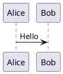
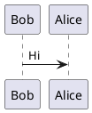

# Chiron Implementation Plan

> **For Claude:** REQUIRED SUB-SKILL: Use superpowers:executing-plans to implement this plan task-by-task.

**Goal:** Build an AI-powered adaptive learning platform that uses Claude Code agents to research topics, generate personalized lessons, and conduct interactive assessments.

**Architecture:** Python CLI orchestrator spawns specialized Claude Code agents via Agent SDK. Agents access local storage (ChromaDB for vectors, SQLite for structured data) through a custom MCP server. The system supports multiple subjects with cross-subject knowledge linking.

**Tech Stack:** Python 3.11+, Click (CLI), Claude Agent SDK, FastMCP, ChromaDB, SQLite, Coqui TTS, PlantUML

---

## Phase Overview

| Phase | Focus | Deliverable |
|-------|-------|-------------|
| 1 | Project Foundation | pyproject.toml, CLI skeleton, config, basic tests |
| 2 | Storage Layer | SQLite models, ChromaDB integration, data access layer |
| 3 | MCP Server | FastMCP server with all tools for agent data access |
| 4 | Agent Framework | Base agent class, all four specialized agents |
| 5 | Orchestrator | Workflow state machine, CLI commands |
| 6 | Content Generation | TTS audio, PlantUML diagrams, exercise rendering |

---

## Phase 1: Project Foundation

### Task 1.1: Initialize Python Project

**Files:**
- Create: `pyproject.toml`
- Create: `src/chiron/__init__.py`
- Create: `src/chiron/__main__.py`
- Create: `src/chiron/cli.py`

**Step 1: Create pyproject.toml**

```toml
[build-system]
requires = ["hatchling"]
build-backend = "hatchling.build"

[project]
name = "chiron"
version = "0.1.0"
description = "AI-powered adaptive learning platform"
readme = "README.md"
license = "MIT"
requires-python = ">=3.11"
dependencies = [
    "click>=8.1.0",
    "rich>=13.0.0",
    "pydantic>=2.0.0",
    "pydantic-settings>=2.0.0",
]

[project.optional-dependencies]
dev = [
    "pytest>=8.0.0",
    "pytest-cov>=4.0.0",
    "pytest-asyncio>=0.23.0",
    "ruff>=0.1.0",
    "mypy>=1.8.0",
]

[project.scripts]
chiron = "chiron.cli:cli"

[tool.hatch.build.targets.wheel]
packages = ["src/chiron"]

[tool.pytest.ini_options]
testpaths = ["tests"]
asyncio_mode = "auto"

[tool.ruff]
line-length = 100
target-version = "py311"

[tool.ruff.lint]
select = ["E", "F", "I", "N", "W", "UP"]

[tool.mypy]
python_version = "3.11"
strict = true
```

**Step 2: Create package init**

Create `src/chiron/__init__.py`:
```python
"""Chiron: AI-powered adaptive learning platform."""

__version__ = "0.1.0"
```

**Step 3: Create entry point**

Create `src/chiron/__main__.py`:
```python
"""Entry point for python -m chiron."""

from chiron.cli import cli

if __name__ == "__main__":
    cli()
```

**Step 4: Create CLI skeleton**

Create `src/chiron/cli.py`:
```python
"""Command-line interface for Chiron."""

import click
from rich.console import Console

console = Console()


@click.group()
@click.version_option()
def cli() -> None:
    """Chiron: AI-powered adaptive learning platform."""
    pass


@cli.command()
def init() -> None:
    """Initialize a new learning subject."""
    console.print("[yellow]Init command not yet implemented[/yellow]")


@cli.command()
def lesson() -> None:
    """Start today's lesson (assessment + learning)."""
    console.print("[yellow]Lesson command not yet implemented[/yellow]")


@cli.command()
def exercises() -> None:
    """Work through reinforcement exercises."""
    console.print("[yellow]Exercises command not yet implemented[/yellow]")


@cli.command()
@click.option("--view", is_flag=True, help="View skill tree visualization")
def tree(view: bool) -> None:
    """View or manage the skill tree."""
    console.print("[yellow]Tree command not yet implemented[/yellow]")


@cli.command()
def progress() -> None:
    """Show learning progress statistics."""
    console.print("[yellow]Progress command not yet implemented[/yellow]")


@cli.command()
def subjects() -> None:
    """List all learning subjects."""
    console.print("[yellow]Subjects command not yet implemented[/yellow]")


@cli.command()
@click.argument("subject_id")
def use(subject_id: str) -> None:
    """Switch to a different learning subject."""
    console.print(f"[yellow]Switching to {subject_id} not yet implemented[/yellow]")


@cli.group()
def research() -> None:
    """Manage research phase."""
    pass


@research.command("start")
def research_start() -> None:
    """Start research for current subject."""
    console.print("[yellow]Research start not yet implemented[/yellow]")


@research.command("status")
def research_status() -> None:
    """Check research progress."""
    console.print("[yellow]Research status not yet implemented[/yellow]")


@research.command("pause")
def research_pause() -> None:
    """Pause research."""
    console.print("[yellow]Research pause not yet implemented[/yellow]")


@research.command("resume")
def research_resume() -> None:
    """Resume research."""
    console.print("[yellow]Research resume not yet implemented[/yellow]")
```

**Step 5: Install in development mode**

Run: `cd /home/frank/repos/Chiron && pip install -e ".[dev]"`

**Step 6: Verify CLI works**

Run: `chiron --version`
Expected: `chiron, version 0.1.0`

Run: `chiron --help`
Expected: Help text showing all commands

**Step 7: Commit**

```bash
git add pyproject.toml src/
git commit -m "feat: initialize project structure with CLI skeleton"
```

---

### Task 1.2: Configuration Management

**Files:**
- Create: `src/chiron/config.py`
- Create: `tests/test_config.py`

**Step 1: Write failing test for config**

Create `tests/__init__.py`:
```python
"""Chiron test suite."""
```

Create `tests/test_config.py`:
```python
"""Tests for configuration management."""

import os
from pathlib import Path

import pytest

from chiron.config import ChironConfig, get_config


def test_config_has_data_dir() -> None:
    """Config should have a data directory path."""
    config = get_config()
    assert config.data_dir is not None
    assert isinstance(config.data_dir, Path)


def test_config_data_dir_default() -> None:
    """Default data dir should be ~/.chiron."""
    config = get_config()
    assert config.data_dir == Path.home() / ".chiron"


def test_config_respects_env_override(monkeypatch: pytest.MonkeyPatch) -> None:
    """Config should respect CHIRON_DATA_DIR env var."""
    monkeypatch.setenv("CHIRON_DATA_DIR", "/tmp/chiron-test")
    # Force reload of config
    config = ChironConfig()
    assert config.data_dir == Path("/tmp/chiron-test")


def test_config_has_database_path() -> None:
    """Config should provide SQLite database path."""
    config = get_config()
    assert config.database_path.name == "chiron.db"
    assert config.database_path.parent == config.data_dir


def test_config_has_mcp_server_settings() -> None:
    """Config should have MCP server host and port."""
    config = get_config()
    assert config.mcp_host == "localhost"
    assert isinstance(config.mcp_port, int)
    assert 1024 <= config.mcp_port <= 65535
```

**Step 2: Run test to verify it fails**

Run: `pytest tests/test_config.py -v`
Expected: FAIL with `ModuleNotFoundError: No module named 'chiron.config'`

**Step 3: Write configuration implementation**

Create `src/chiron/config.py`:
```python
"""Configuration management for Chiron."""

from functools import lru_cache
from pathlib import Path

from pydantic import Field
from pydantic_settings import BaseSettings, SettingsConfigDict


class ChironConfig(BaseSettings):
    """Application configuration with environment variable support."""

    model_config = SettingsConfigDict(
        env_prefix="CHIRON_",
        env_file=".env",
        env_file_encoding="utf-8",
    )

    # Paths
    data_dir: Path = Field(default_factory=lambda: Path.home() / ".chiron")

    # MCP Server
    mcp_host: str = "localhost"
    mcp_port: int = 8742

    # ChromaDB
    chroma_collection_prefix: str = "chiron"

    # Agent settings
    agent_model: str = "claude-sonnet-4-20250514"
    agent_max_tokens: int = 8192

    @property
    def database_path(self) -> Path:
        """Path to SQLite database."""
        return self.data_dir / "chiron.db"

    @property
    def knowledge_bases_dir(self) -> Path:
        """Directory for subject knowledge bases."""
        return self.data_dir / "knowledge_bases"

    @property
    def lessons_dir(self) -> Path:
        """Directory for generated lessons."""
        return self.data_dir / "lessons"

    @property
    def progress_dir(self) -> Path:
        """Directory for progress tracking files."""
        return self.data_dir / "progress"

    def ensure_directories(self) -> None:
        """Create all required directories if they don't exist."""
        self.data_dir.mkdir(parents=True, exist_ok=True)
        self.knowledge_bases_dir.mkdir(exist_ok=True)
        self.lessons_dir.mkdir(exist_ok=True)
        self.progress_dir.mkdir(exist_ok=True)


@lru_cache
def get_config() -> ChironConfig:
    """Get cached configuration instance."""
    return ChironConfig()
```

**Step 4: Run test to verify it passes**

Run: `pytest tests/test_config.py -v`
Expected: All 5 tests PASS

**Step 5: Commit**

```bash
git add src/chiron/config.py tests/
git commit -m "feat: add configuration management with pydantic-settings"
```

---

### Task 1.3: Data Models

**Files:**
- Create: `src/chiron/models.py`
- Create: `tests/test_models.py`

**Step 1: Write failing tests for data models**

Create `tests/test_models.py`:
```python
"""Tests for data models."""

from datetime import datetime

from chiron.models import (
    LearningGoal,
    KnowledgeNode,
    UserProgress,
    Source,
    Lesson,
    AssessmentResponse,
    SubjectStatus,
)


def test_learning_goal_creation() -> None:
    """LearningGoal should store subject and purpose."""
    goal = LearningGoal(
        subject_id="kubernetes",
        purpose_statement="Maintain K8S repos in my organization",
        target_depth="practical",
    )
    assert goal.subject_id == "kubernetes"
    assert goal.purpose_statement == "Maintain K8S repos in my organization"
    assert goal.research_complete is False


def test_knowledge_node_hierarchy() -> None:
    """KnowledgeNode should support parent-child relationships."""
    parent = KnowledgeNode(
        id=1,
        subject_id="kubernetes",
        title="Architecture",
        depth=0,
    )
    child = KnowledgeNode(
        id=2,
        subject_id="kubernetes",
        parent_id=1,
        title="Pods",
        depth=1,
    )
    assert child.parent_id == parent.id
    assert child.depth == parent.depth + 1


def test_knowledge_node_prerequisites() -> None:
    """KnowledgeNode should track prerequisites."""
    node = KnowledgeNode(
        id=1,
        subject_id="kubernetes",
        title="Deployments",
        depth=1,
        prerequisites=[2, 3],
    )
    assert 2 in node.prerequisites
    assert 3 in node.prerequisites


def test_user_progress_mastery_bounds() -> None:
    """Mastery level should be between 0 and 1."""
    progress = UserProgress(
        node_id=1,
        mastery_level=0.75,
    )
    assert 0.0 <= progress.mastery_level <= 1.0


def test_source_types() -> None:
    """Source should categorize by type."""
    academic = Source(
        url="https://arxiv.org/paper",
        source_type="academic",
        base_dependability_score=0.9,
    )
    blog = Source(
        url="https://blog.example.com/post",
        source_type="expert_blog",
        base_dependability_score=0.6,
    )
    assert academic.base_dependability_score > blog.base_dependability_score


def test_lesson_has_paths() -> None:
    """Lesson should track file paths for materials."""
    lesson = Lesson(
        subject_id="kubernetes",
        date=datetime.now().date(),
        node_ids_covered=[1, 2, 3],
        audio_path="/path/to/audio.mp3",
        materials_path="/path/to/materials/",
    )
    assert lesson.audio_path is not None
    assert len(lesson.node_ids_covered) == 3


def test_assessment_response_srs() -> None:
    """AssessmentResponse should track SRS scheduling."""
    response = AssessmentResponse(
        lesson_id=1,
        node_id=1,
        question_hash="abc123",
        response="The answer",
        correct=True,
    )
    assert response.next_review is not None


def test_subject_status_enum() -> None:
    """SubjectStatus should have expected values."""
    assert SubjectStatus.INITIALIZING.value == "initializing"
    assert SubjectStatus.RESEARCHING.value == "researching"
    assert SubjectStatus.READY.value == "ready"
    assert SubjectStatus.PAUSED.value == "paused"
```

**Step 2: Run test to verify it fails**

Run: `pytest tests/test_models.py -v`
Expected: FAIL with `ModuleNotFoundError: No module named 'chiron.models'`

**Step 3: Write models implementation**

Create `src/chiron/models.py`:
```python
"""Data models for Chiron."""

from datetime import date, datetime, timedelta
from enum import Enum
from typing import Optional

from pydantic import BaseModel, Field, field_validator


class SubjectStatus(str, Enum):
    """Status of a learning subject."""

    INITIALIZING = "initializing"
    RESEARCHING = "researching"
    READY = "ready"
    PAUSED = "paused"


class LearningGoal(BaseModel):
    """A learning goal for a subject."""

    id: Optional[int] = None
    subject_id: str
    purpose_statement: str
    target_depth: str = "practical"
    created_date: datetime = Field(default_factory=datetime.now)
    research_complete: bool = False
    status: SubjectStatus = SubjectStatus.INITIALIZING


class KnowledgeNode(BaseModel):
    """A node in the knowledge/skill tree."""

    id: Optional[int] = None
    subject_id: str
    parent_id: Optional[int] = None
    title: str
    description: Optional[str] = None
    depth: int = 0
    is_goal_critical: bool = False
    prerequisites: list[int] = Field(default_factory=list)
    shared_with_subjects: list[str] = Field(default_factory=list)


class UserProgress(BaseModel):
    """User's progress on a knowledge node."""

    node_id: int
    mastery_level: float = 0.0
    last_assessed: Optional[datetime] = None
    next_review_date: Optional[datetime] = None
    assessment_history: list[float] = Field(default_factory=list)
    ease_factor: float = 2.5  # SM-2 ease factor

    @field_validator("mastery_level")
    @classmethod
    def validate_mastery(cls, v: float) -> float:
        """Ensure mastery is between 0 and 1."""
        return max(0.0, min(1.0, v))


class Source(BaseModel):
    """A source of information."""

    id: Optional[int] = None
    url: str
    source_type: str  # academic, official_docs, expert_blog, etc.
    base_dependability_score: float
    validation_count: int = 0
    last_checked: Optional[datetime] = None
    notes: Optional[str] = None

    @field_validator("base_dependability_score")
    @classmethod
    def validate_score(cls, v: float) -> float:
        """Ensure score is between 0 and 1."""
        return max(0.0, min(1.0, v))


class Lesson(BaseModel):
    """A generated lesson."""

    id: Optional[int] = None
    subject_id: str
    date: date
    node_ids_covered: list[int] = Field(default_factory=list)
    audio_path: Optional[str] = None
    materials_path: Optional[str] = None
    duration_minutes: Optional[int] = None


class AssessmentResponse(BaseModel):
    """A user's response to an assessment question."""

    id: Optional[int] = None
    lesson_id: Optional[int] = None
    node_id: int
    question_hash: str
    response: str
    correct: bool
    timestamp: datetime = Field(default_factory=datetime.now)
    next_review: datetime = Field(
        default_factory=lambda: datetime.now() + timedelta(days=1)
    )


class KnowledgeChunk(BaseModel):
    """A chunk of validated knowledge for vector storage."""

    content: str
    subject_id: str
    source_url: str
    source_score: float
    topic_path: str
    confidence: float
    contradictions: list[str] = Field(default_factory=list)
    last_validated: datetime = Field(default_factory=datetime.now)


class CoverageMapNode(BaseModel):
    """A node in the coverage map (curriculum structure)."""

    id: str
    title: str
    description: Optional[str] = None
    children: list["CoverageMapNode"] = Field(default_factory=list)
    research_status: str = "pending"  # pending, in_progress, complete
    confidence: float = 0.0


# Enable forward references
CoverageMapNode.model_rebuild()
```

**Step 4: Run test to verify it passes**

Run: `pytest tests/test_models.py -v`
Expected: All 9 tests PASS

**Step 5: Commit**

```bash
git add src/chiron/models.py tests/test_models.py
git commit -m "feat: add Pydantic data models for all domain entities"
```

---

## Phase 2: Storage Layer

### Task 2.1: SQLite Database Setup

**Files:**
- Create: `src/chiron/storage/__init__.py`
- Create: `src/chiron/storage/database.py`
- Create: `tests/test_database.py`

**Step 1: Write failing tests for database**

Create `tests/test_database.py`:
```python
"""Tests for SQLite database operations."""

import pytest
from pathlib import Path

from chiron.storage.database import Database
from chiron.models import LearningGoal, KnowledgeNode, Source


@pytest.fixture
def db(tmp_path: Path) -> Database:
    """Create a test database."""
    db_path = tmp_path / "test.db"
    database = Database(db_path)
    database.initialize()
    return database


def test_database_creates_tables(db: Database) -> None:
    """Database should create all required tables."""
    tables = db.get_tables()
    assert "learning_goals" in tables
    assert "knowledge_nodes" in tables
    assert "user_progress" in tables
    assert "sources" in tables
    assert "lessons" in tables
    assert "responses" in tables
    assert "settings" in tables


def test_save_and_get_learning_goal(db: Database) -> None:
    """Should save and retrieve a learning goal."""
    goal = LearningGoal(
        subject_id="kubernetes",
        purpose_statement="Learn K8S for work",
    )
    saved = db.save_learning_goal(goal)
    assert saved.id is not None

    retrieved = db.get_learning_goal("kubernetes")
    assert retrieved is not None
    assert retrieved.subject_id == "kubernetes"
    assert retrieved.purpose_statement == "Learn K8S for work"


def test_save_and_get_knowledge_node(db: Database) -> None:
    """Should save and retrieve knowledge nodes."""
    node = KnowledgeNode(
        subject_id="kubernetes",
        title="Pods",
        depth=1,
    )
    saved = db.save_knowledge_node(node)
    assert saved.id is not None

    retrieved = db.get_knowledge_node(saved.id)
    assert retrieved is not None
    assert retrieved.title == "Pods"


def test_get_knowledge_tree(db: Database) -> None:
    """Should retrieve all nodes for a subject."""
    parent = db.save_knowledge_node(KnowledgeNode(
        subject_id="kubernetes",
        title="Architecture",
        depth=0,
    ))
    db.save_knowledge_node(KnowledgeNode(
        subject_id="kubernetes",
        parent_id=parent.id,
        title="Pods",
        depth=1,
    ))
    db.save_knowledge_node(KnowledgeNode(
        subject_id="kubernetes",
        parent_id=parent.id,
        title="Services",
        depth=1,
    ))

    nodes = db.get_knowledge_tree("kubernetes")
    assert len(nodes) == 3


def test_active_subject_setting(db: Database) -> None:
    """Should get and set active subject."""
    db.set_setting("active_subject", "kubernetes")
    assert db.get_setting("active_subject") == "kubernetes"

    db.set_setting("active_subject", "philosophy")
    assert db.get_setting("active_subject") == "philosophy"


def test_list_subjects(db: Database) -> None:
    """Should list all subjects."""
    db.save_learning_goal(LearningGoal(
        subject_id="kubernetes",
        purpose_statement="Learn K8S",
    ))
    db.save_learning_goal(LearningGoal(
        subject_id="philosophy",
        purpose_statement="Learn philosophy",
    ))

    subjects = db.list_subjects()
    assert len(subjects) == 2
    assert "kubernetes" in [s.subject_id for s in subjects]
    assert "philosophy" in [s.subject_id for s in subjects]
```

**Step 2: Run test to verify it fails**

Run: `pytest tests/test_database.py -v`
Expected: FAIL with `ModuleNotFoundError: No module named 'chiron.storage'`

**Step 3: Write database implementation**

Create `src/chiron/storage/__init__.py`:
```python
"""Storage layer for Chiron."""

from chiron.storage.database import Database

__all__ = ["Database"]
```

Create `src/chiron/storage/database.py`:
```python
"""SQLite database operations for Chiron."""

import json
import sqlite3
from contextlib import contextmanager
from datetime import datetime
from pathlib import Path
from typing import Iterator, Optional

from chiron.models import (
    KnowledgeNode,
    LearningGoal,
    Lesson,
    Source,
    UserProgress,
    AssessmentResponse,
)


class Database:
    """SQLite database wrapper for Chiron."""

    def __init__(self, db_path: Path) -> None:
        """Initialize database connection."""
        self.db_path = db_path
        self._connection: Optional[sqlite3.Connection] = None

    @contextmanager
    def _get_connection(self) -> Iterator[sqlite3.Connection]:
        """Get a database connection."""
        conn = sqlite3.connect(self.db_path)
        conn.row_factory = sqlite3.Row
        try:
            yield conn
            conn.commit()
        except Exception:
            conn.rollback()
            raise
        finally:
            conn.close()

    def initialize(self) -> None:
        """Create all database tables."""
        with self._get_connection() as conn:
            conn.executescript("""
                -- Learning goals
                CREATE TABLE IF NOT EXISTS learning_goals (
                    id INTEGER PRIMARY KEY,
                    subject_id TEXT UNIQUE NOT NULL,
                    purpose_statement TEXT NOT NULL,
                    target_depth TEXT,
                    created_date TIMESTAMP DEFAULT CURRENT_TIMESTAMP,
                    research_complete BOOLEAN DEFAULT FALSE,
                    status TEXT DEFAULT 'initializing'
                );

                -- Knowledge structure (skill tree)
                CREATE TABLE IF NOT EXISTS knowledge_nodes (
                    id INTEGER PRIMARY KEY,
                    subject_id TEXT NOT NULL,
                    parent_id INTEGER REFERENCES knowledge_nodes(id),
                    title TEXT NOT NULL,
                    description TEXT,
                    depth INTEGER DEFAULT 0,
                    is_goal_critical BOOLEAN DEFAULT FALSE,
                    prerequisites_json TEXT DEFAULT '[]',
                    shared_with_subjects TEXT DEFAULT '[]'
                );

                -- Learning progress
                CREATE TABLE IF NOT EXISTS user_progress (
                    node_id INTEGER PRIMARY KEY REFERENCES knowledge_nodes(id),
                    mastery_level REAL DEFAULT 0.0,
                    last_assessed TIMESTAMP,
                    next_review_date TIMESTAMP,
                    assessment_history_json TEXT DEFAULT '[]',
                    ease_factor REAL DEFAULT 2.5
                );

                -- Sources
                CREATE TABLE IF NOT EXISTS sources (
                    id INTEGER PRIMARY KEY,
                    url TEXT UNIQUE NOT NULL,
                    source_type TEXT,
                    base_dependability_score REAL,
                    validation_count INTEGER DEFAULT 0,
                    last_checked TIMESTAMP,
                    notes TEXT
                );

                -- Lessons
                CREATE TABLE IF NOT EXISTS lessons (
                    id INTEGER PRIMARY KEY,
                    subject_id TEXT NOT NULL,
                    date DATE NOT NULL,
                    node_ids_covered TEXT DEFAULT '[]',
                    audio_path TEXT,
                    materials_path TEXT,
                    duration_minutes INTEGER
                );

                -- Assessment responses
                CREATE TABLE IF NOT EXISTS responses (
                    id INTEGER PRIMARY KEY,
                    lesson_id INTEGER REFERENCES lessons(id),
                    node_id INTEGER REFERENCES knowledge_nodes(id),
                    question_hash TEXT,
                    response TEXT,
                    correct BOOLEAN,
                    timestamp TIMESTAMP DEFAULT CURRENT_TIMESTAMP,
                    next_review TIMESTAMP
                );

                -- Settings
                CREATE TABLE IF NOT EXISTS settings (
                    key TEXT PRIMARY KEY,
                    value TEXT
                );

                -- Indexes
                CREATE INDEX IF NOT EXISTS idx_nodes_subject ON knowledge_nodes(subject_id);
                CREATE INDEX IF NOT EXISTS idx_nodes_parent ON knowledge_nodes(parent_id);
                CREATE INDEX IF NOT EXISTS idx_lessons_subject ON lessons(subject_id);
                CREATE INDEX IF NOT EXISTS idx_responses_node ON responses(node_id);
            """)

    def get_tables(self) -> list[str]:
        """Get list of all tables in database."""
        with self._get_connection() as conn:
            cursor = conn.execute(
                "SELECT name FROM sqlite_master WHERE type='table'"
            )
            return [row["name"] for row in cursor.fetchall()]

    # Learning Goals

    def save_learning_goal(self, goal: LearningGoal) -> LearningGoal:
        """Save a learning goal."""
        with self._get_connection() as conn:
            cursor = conn.execute(
                """
                INSERT INTO learning_goals
                    (subject_id, purpose_statement, target_depth, research_complete, status)
                VALUES (?, ?, ?, ?, ?)
                ON CONFLICT(subject_id) DO UPDATE SET
                    purpose_statement = excluded.purpose_statement,
                    target_depth = excluded.target_depth,
                    research_complete = excluded.research_complete,
                    status = excluded.status
                RETURNING id
                """,
                (
                    goal.subject_id,
                    goal.purpose_statement,
                    goal.target_depth,
                    goal.research_complete,
                    goal.status.value,
                ),
            )
            goal.id = cursor.fetchone()["id"]
            return goal

    def get_learning_goal(self, subject_id: str) -> Optional[LearningGoal]:
        """Get a learning goal by subject ID."""
        with self._get_connection() as conn:
            cursor = conn.execute(
                "SELECT * FROM learning_goals WHERE subject_id = ?",
                (subject_id,),
            )
            row = cursor.fetchone()
            if row is None:
                return None
            return LearningGoal(
                id=row["id"],
                subject_id=row["subject_id"],
                purpose_statement=row["purpose_statement"],
                target_depth=row["target_depth"],
                created_date=datetime.fromisoformat(row["created_date"]),
                research_complete=bool(row["research_complete"]),
            )

    def list_subjects(self) -> list[LearningGoal]:
        """List all subjects."""
        with self._get_connection() as conn:
            cursor = conn.execute("SELECT * FROM learning_goals ORDER BY subject_id")
            return [
                LearningGoal(
                    id=row["id"],
                    subject_id=row["subject_id"],
                    purpose_statement=row["purpose_statement"],
                    target_depth=row["target_depth"],
                    created_date=datetime.fromisoformat(row["created_date"]),
                    research_complete=bool(row["research_complete"]),
                )
                for row in cursor.fetchall()
            ]

    # Knowledge Nodes

    def save_knowledge_node(self, node: KnowledgeNode) -> KnowledgeNode:
        """Save a knowledge node."""
        with self._get_connection() as conn:
            cursor = conn.execute(
                """
                INSERT INTO knowledge_nodes
                    (subject_id, parent_id, title, description, depth,
                     is_goal_critical, prerequisites_json, shared_with_subjects)
                VALUES (?, ?, ?, ?, ?, ?, ?, ?)
                RETURNING id
                """,
                (
                    node.subject_id,
                    node.parent_id,
                    node.title,
                    node.description,
                    node.depth,
                    node.is_goal_critical,
                    json.dumps(node.prerequisites),
                    json.dumps(node.shared_with_subjects),
                ),
            )
            node.id = cursor.fetchone()["id"]
            return node

    def get_knowledge_node(self, node_id: int) -> Optional[KnowledgeNode]:
        """Get a knowledge node by ID."""
        with self._get_connection() as conn:
            cursor = conn.execute(
                "SELECT * FROM knowledge_nodes WHERE id = ?",
                (node_id,),
            )
            row = cursor.fetchone()
            if row is None:
                return None
            return KnowledgeNode(
                id=row["id"],
                subject_id=row["subject_id"],
                parent_id=row["parent_id"],
                title=row["title"],
                description=row["description"],
                depth=row["depth"],
                is_goal_critical=bool(row["is_goal_critical"]),
                prerequisites=json.loads(row["prerequisites_json"]),
                shared_with_subjects=json.loads(row["shared_with_subjects"]),
            )

    def get_knowledge_tree(self, subject_id: str) -> list[KnowledgeNode]:
        """Get all knowledge nodes for a subject."""
        with self._get_connection() as conn:
            cursor = conn.execute(
                "SELECT * FROM knowledge_nodes WHERE subject_id = ? ORDER BY depth, title",
                (subject_id,),
            )
            return [
                KnowledgeNode(
                    id=row["id"],
                    subject_id=row["subject_id"],
                    parent_id=row["parent_id"],
                    title=row["title"],
                    description=row["description"],
                    depth=row["depth"],
                    is_goal_critical=bool(row["is_goal_critical"]),
                    prerequisites=json.loads(row["prerequisites_json"]),
                    shared_with_subjects=json.loads(row["shared_with_subjects"]),
                )
                for row in cursor.fetchall()
            ]

    # Settings

    def get_setting(self, key: str) -> Optional[str]:
        """Get a setting value."""
        with self._get_connection() as conn:
            cursor = conn.execute(
                "SELECT value FROM settings WHERE key = ?",
                (key,),
            )
            row = cursor.fetchone()
            return row["value"] if row else None

    def set_setting(self, key: str, value: str) -> None:
        """Set a setting value."""
        with self._get_connection() as conn:
            conn.execute(
                """
                INSERT INTO settings (key, value) VALUES (?, ?)
                ON CONFLICT(key) DO UPDATE SET value = excluded.value
                """,
                (key, value),
            )
```

**Step 4: Run test to verify it passes**

Run: `pytest tests/test_database.py -v`
Expected: All 6 tests PASS

**Step 5: Commit**

```bash
git add src/chiron/storage/ tests/test_database.py
git commit -m "feat: add SQLite database layer with CRUD operations"
```

---

### Task 2.2: ChromaDB Vector Store

**Files:**
- Create: `src/chiron/storage/vector_store.py`
- Create: `tests/test_vector_store.py`
- Modify: `pyproject.toml` (add chromadb dependency)

**Step 1: Add ChromaDB dependency**

Edit `pyproject.toml` dependencies:
```toml
dependencies = [
    "click>=8.1.0",
    "rich>=13.0.0",
    "pydantic>=2.0.0",
    "pydantic-settings>=2.0.0",
    "chromadb>=0.4.0",
]
```

Run: `pip install -e ".[dev]"`

**Step 2: Write failing tests for vector store**

Create `tests/test_vector_store.py`:
```python
"""Tests for ChromaDB vector store."""

import pytest
from pathlib import Path

from chiron.storage.vector_store import VectorStore
from chiron.models import KnowledgeChunk


@pytest.fixture
def vector_store(tmp_path: Path) -> VectorStore:
    """Create a test vector store."""
    return VectorStore(persist_dir=tmp_path / "chroma")


def test_store_and_search_knowledge(vector_store: VectorStore) -> None:
    """Should store and retrieve knowledge chunks."""
    chunk = KnowledgeChunk(
        content="Pods are the smallest deployable units in Kubernetes.",
        subject_id="kubernetes",
        source_url="https://kubernetes.io/docs/concepts/pods/",
        source_score=0.9,
        topic_path="Architecture/Pods",
        confidence=0.95,
    )

    vector_store.store_knowledge(chunk)

    results = vector_store.search("What are pods?", subject_id="kubernetes", top_k=1)
    assert len(results) == 1
    assert "pods" in results[0].content.lower()


def test_search_filters_by_subject(vector_store: VectorStore) -> None:
    """Should filter search results by subject."""
    vector_store.store_knowledge(KnowledgeChunk(
        content="Pods are the smallest deployable units in Kubernetes.",
        subject_id="kubernetes",
        source_url="https://kubernetes.io/",
        source_score=0.9,
        topic_path="Pods",
        confidence=0.95,
    ))
    vector_store.store_knowledge(KnowledgeChunk(
        content="Plato was a student of Socrates.",
        subject_id="philosophy",
        source_url="https://plato.stanford.edu/",
        source_score=0.9,
        topic_path="Greek/Plato",
        confidence=0.95,
    ))

    k8s_results = vector_store.search("pods", subject_id="kubernetes", top_k=5)
    phil_results = vector_store.search("Plato", subject_id="philosophy", top_k=5)

    assert all(r.subject_id == "kubernetes" for r in k8s_results)
    assert all(r.subject_id == "philosophy" for r in phil_results)


def test_search_returns_metadata(vector_store: VectorStore) -> None:
    """Search results should include all metadata."""
    chunk = KnowledgeChunk(
        content="Services expose pods to network traffic.",
        subject_id="kubernetes",
        source_url="https://kubernetes.io/docs/services/",
        source_score=0.85,
        topic_path="Architecture/Services",
        confidence=0.9,
    )
    vector_store.store_knowledge(chunk)

    results = vector_store.search("network", subject_id="kubernetes", top_k=1)
    assert len(results) == 1
    result = results[0]
    assert result.source_url == "https://kubernetes.io/docs/services/"
    assert result.source_score == 0.85
    assert result.topic_path == "Architecture/Services"


def test_delete_by_subject(vector_store: VectorStore) -> None:
    """Should delete all chunks for a subject."""
    vector_store.store_knowledge(KnowledgeChunk(
        content="Test content 1",
        subject_id="test_subject",
        source_url="https://example.com/1",
        source_score=0.9,
        topic_path="Topic1",
        confidence=0.95,
    ))
    vector_store.store_knowledge(KnowledgeChunk(
        content="Test content 2",
        subject_id="test_subject",
        source_url="https://example.com/2",
        source_score=0.9,
        topic_path="Topic2",
        confidence=0.95,
    ))

    vector_store.delete_subject("test_subject")
    results = vector_store.search("test", subject_id="test_subject", top_k=10)
    assert len(results) == 0
```

**Step 3: Run test to verify it fails**

Run: `pytest tests/test_vector_store.py -v`
Expected: FAIL with `ModuleNotFoundError: No module named 'chiron.storage.vector_store'`

**Step 4: Write vector store implementation**

Create `src/chiron/storage/vector_store.py`:
```python
"""ChromaDB vector store for knowledge embeddings."""

import hashlib
from datetime import datetime
from pathlib import Path
from typing import Optional

import chromadb
from chromadb.config import Settings

from chiron.models import KnowledgeChunk


class VectorStore:
    """ChromaDB-backed vector store for knowledge chunks."""

    COLLECTION_NAME = "knowledge_chunks"

    def __init__(self, persist_dir: Path) -> None:
        """Initialize the vector store."""
        self.persist_dir = persist_dir
        self._client = chromadb.PersistentClient(
            path=str(persist_dir),
            settings=Settings(anonymized_telemetry=False),
        )
        self._collection = self._client.get_or_create_collection(
            name=self.COLLECTION_NAME,
            metadata={"hnsw:space": "cosine"},
        )

    def _generate_id(self, chunk: KnowledgeChunk) -> str:
        """Generate a unique ID for a chunk."""
        content_hash = hashlib.sha256(
            f"{chunk.subject_id}:{chunk.source_url}:{chunk.content}".encode()
        ).hexdigest()[:16]
        return content_hash

    def store_knowledge(self, chunk: KnowledgeChunk) -> str:
        """Store a knowledge chunk and return its ID."""
        chunk_id = self._generate_id(chunk)

        self._collection.upsert(
            ids=[chunk_id],
            documents=[chunk.content],
            metadatas=[{
                "subject_id": chunk.subject_id,
                "source_url": chunk.source_url,
                "source_score": chunk.source_score,
                "topic_path": chunk.topic_path,
                "confidence": chunk.confidence,
                "contradictions": ",".join(chunk.contradictions),
                "last_validated": chunk.last_validated.isoformat(),
            }],
        )
        return chunk_id

    def search(
        self,
        query: str,
        subject_id: str,
        top_k: int = 10,
        min_confidence: float = 0.0,
    ) -> list[KnowledgeChunk]:
        """Search for relevant knowledge chunks."""
        results = self._collection.query(
            query_texts=[query],
            n_results=top_k,
            where={"subject_id": subject_id},
        )

        chunks = []
        if results["documents"] and results["documents"][0]:
            for i, doc in enumerate(results["documents"][0]):
                metadata = results["metadatas"][0][i] if results["metadatas"] else {}

                confidence = float(metadata.get("confidence", 0.0))
                if confidence < min_confidence:
                    continue

                contradictions_str = metadata.get("contradictions", "")
                contradictions = (
                    contradictions_str.split(",")
                    if contradictions_str
                    else []
                )

                chunk = KnowledgeChunk(
                    content=doc,
                    subject_id=metadata.get("subject_id", subject_id),
                    source_url=metadata.get("source_url", ""),
                    source_score=float(metadata.get("source_score", 0.0)),
                    topic_path=metadata.get("topic_path", ""),
                    confidence=confidence,
                    contradictions=contradictions,
                    last_validated=datetime.fromisoformat(
                        metadata.get("last_validated", datetime.now().isoformat())
                    ),
                )
                chunks.append(chunk)

        return chunks

    def delete_subject(self, subject_id: str) -> None:
        """Delete all chunks for a subject."""
        # Get all IDs for this subject
        results = self._collection.get(
            where={"subject_id": subject_id},
        )
        if results["ids"]:
            self._collection.delete(ids=results["ids"])

    def get_by_topic(
        self,
        subject_id: str,
        topic_path: str,
    ) -> list[KnowledgeChunk]:
        """Get all chunks for a specific topic path."""
        results = self._collection.get(
            where={
                "$and": [
                    {"subject_id": subject_id},
                    {"topic_path": {"$eq": topic_path}},
                ]
            },
        )

        chunks = []
        if results["documents"]:
            for i, doc in enumerate(results["documents"]):
                metadata = results["metadatas"][i] if results["metadatas"] else {}

                contradictions_str = metadata.get("contradictions", "")
                contradictions = (
                    contradictions_str.split(",")
                    if contradictions_str
                    else []
                )

                chunk = KnowledgeChunk(
                    content=doc,
                    subject_id=metadata.get("subject_id", subject_id),
                    source_url=metadata.get("source_url", ""),
                    source_score=float(metadata.get("source_score", 0.0)),
                    topic_path=metadata.get("topic_path", ""),
                    confidence=float(metadata.get("confidence", 0.0)),
                    contradictions=contradictions,
                    last_validated=datetime.fromisoformat(
                        metadata.get("last_validated", datetime.now().isoformat())
                    ),
                )
                chunks.append(chunk)

        return chunks
```

Update `src/chiron/storage/__init__.py`:
```python
"""Storage layer for Chiron."""

from chiron.storage.database import Database
from chiron.storage.vector_store import VectorStore

__all__ = ["Database", "VectorStore"]
```

**Step 5: Run test to verify it passes**

Run: `pytest tests/test_vector_store.py -v`
Expected: All 4 tests PASS

**Step 6: Commit**

```bash
git add pyproject.toml src/chiron/storage/ tests/test_vector_store.py
git commit -m "feat: add ChromaDB vector store for knowledge embeddings"
```

---

## Phase 3: MCP Server

### Task 3.1: MCP Server Foundation

**Files:**
- Create: `src/chiron/mcp_server/__init__.py`
- Create: `src/chiron/mcp_server/server.py`
- Create: `tests/test_mcp_server.py`
- Modify: `pyproject.toml` (add fastmcp dependency)

**Step 1: Add FastMCP dependency**

Edit `pyproject.toml` dependencies:
```toml
dependencies = [
    "click>=8.1.0",
    "rich>=13.0.0",
    "pydantic>=2.0.0",
    "pydantic-settings>=2.0.0",
    "chromadb>=0.4.0",
    "fastmcp>=0.1.0",
]
```

Run: `pip install -e ".[dev]"`

**Step 2: Write failing test for MCP server**

Create `tests/test_mcp_server.py`:
```python
"""Tests for MCP server."""

import pytest
from pathlib import Path

from chiron.mcp_server.server import create_mcp_server
from chiron.storage.database import Database
from chiron.storage.vector_store import VectorStore


@pytest.fixture
def test_storage(tmp_path: Path) -> tuple[Database, VectorStore]:
    """Create test storage instances."""
    db = Database(tmp_path / "test.db")
    db.initialize()
    vs = VectorStore(tmp_path / "chroma")
    return db, vs


def test_mcp_server_has_required_tools(test_storage: tuple[Database, VectorStore]) -> None:
    """MCP server should expose required tools."""
    db, vs = test_storage
    server = create_mcp_server(db, vs)

    tool_names = [t.name for t in server.list_tools()]

    # Knowledge tools
    assert "vector_search" in tool_names
    assert "store_knowledge" in tool_names

    # Subject management
    assert "get_active_subject" in tool_names
    assert "set_active_subject" in tool_names
    assert "list_subjects" in tool_names

    # Progress tools
    assert "get_user_progress" in tool_names
    assert "record_assessment" in tool_names

    # Curriculum tools
    assert "get_learning_goal" in tool_names
    assert "save_learning_goal" in tool_names


def test_mcp_server_tool_descriptions(test_storage: tuple[Database, VectorStore]) -> None:
    """All MCP tools should have descriptions."""
    db, vs = test_storage
    server = create_mcp_server(db, vs)

    for tool in server.list_tools():
        assert tool.description, f"Tool {tool.name} missing description"
```

**Step 3: Run test to verify it fails**

Run: `pytest tests/test_mcp_server.py -v`
Expected: FAIL with `ModuleNotFoundError: No module named 'chiron.mcp_server'`

**Step 4: Write MCP server implementation**

Create `src/chiron/mcp_server/__init__.py`:
```python
"""MCP server for Chiron agents."""

from chiron.mcp_server.server import create_mcp_server

__all__ = ["create_mcp_server"]
```

Create `src/chiron/mcp_server/server.py`:
```python
"""FastMCP server implementation for Chiron."""

from datetime import datetime
from typing import Optional

from fastmcp import FastMCP

from chiron.models import (
    KnowledgeChunk,
    KnowledgeNode,
    LearningGoal,
    UserProgress,
)
from chiron.storage.database import Database
from chiron.storage.vector_store import VectorStore


def create_mcp_server(db: Database, vector_store: VectorStore) -> FastMCP:
    """Create and configure the MCP server with all tools."""

    mcp = FastMCP("Chiron Learning Platform")

    # ============ Knowledge Base Tools ============

    @mcp.tool()
    def vector_search(
        query: str,
        subject_id: str,
        top_k: int = 10,
        min_confidence: float = 0.0,
    ) -> list[dict]:
        """Search the knowledge base for relevant content.

        Args:
            query: Natural language search query
            subject_id: Subject to search within
            top_k: Maximum number of results
            min_confidence: Minimum confidence threshold (0-1)

        Returns:
            List of matching knowledge chunks with metadata
        """
        chunks = vector_store.search(
            query=query,
            subject_id=subject_id,
            top_k=top_k,
            min_confidence=min_confidence,
        )
        return [chunk.model_dump() for chunk in chunks]

    @mcp.tool()
    def store_knowledge(
        content: str,
        subject_id: str,
        source_url: str,
        source_score: float,
        topic_path: str,
        confidence: float,
        contradictions: Optional[list[str]] = None,
    ) -> str:
        """Store validated knowledge in the vector database.

        Args:
            content: The knowledge content to store
            subject_id: Subject this knowledge belongs to
            source_url: URL of the source
            source_score: Dependability score of the source (0-1)
            topic_path: Hierarchical topic path (e.g., "Architecture/Pods")
            confidence: Confidence in this fact (0-1)
            contradictions: List of contradicting claims, if any

        Returns:
            ID of the stored chunk
        """
        chunk = KnowledgeChunk(
            content=content,
            subject_id=subject_id,
            source_url=source_url,
            source_score=source_score,
            topic_path=topic_path,
            confidence=confidence,
            contradictions=contradictions or [],
        )
        return vector_store.store_knowledge(chunk)

    # ============ Subject Management Tools ============

    @mcp.tool()
    def get_active_subject() -> Optional[str]:
        """Get the currently active learning subject.

        Returns:
            Subject ID of active subject, or None if not set
        """
        return db.get_setting("active_subject")

    @mcp.tool()
    def set_active_subject(subject_id: str) -> bool:
        """Set the active learning subject.

        Args:
            subject_id: ID of subject to make active

        Returns:
            True if successful
        """
        db.set_setting("active_subject", subject_id)
        return True

    @mcp.tool()
    def list_subjects() -> list[dict]:
        """List all learning subjects.

        Returns:
            List of all subjects with their goals and status
        """
        goals = db.list_subjects()
        return [goal.model_dump() for goal in goals]

    # ============ Learning Goal Tools ============

    @mcp.tool()
    def get_learning_goal(subject_id: str) -> Optional[dict]:
        """Get the learning goal for a subject.

        Args:
            subject_id: Subject to get goal for

        Returns:
            Learning goal details or None
        """
        goal = db.get_learning_goal(subject_id)
        return goal.model_dump() if goal else None

    @mcp.tool()
    def save_learning_goal(
        subject_id: str,
        purpose_statement: str,
        target_depth: str = "practical",
    ) -> dict:
        """Save a new learning goal.

        Args:
            subject_id: Unique identifier for the subject
            purpose_statement: Why the user wants to learn this
            target_depth: How deep to go (practical, comprehensive, expert)

        Returns:
            Saved learning goal
        """
        goal = LearningGoal(
            subject_id=subject_id,
            purpose_statement=purpose_statement,
            target_depth=target_depth,
        )
        saved = db.save_learning_goal(goal)
        return saved.model_dump()

    # ============ Knowledge Node Tools ============

    @mcp.tool()
    def get_knowledge_node(node_id: int) -> Optional[dict]:
        """Get a specific knowledge node.

        Args:
            node_id: ID of the node to retrieve

        Returns:
            Knowledge node details or None
        """
        node = db.get_knowledge_node(node_id)
        return node.model_dump() if node else None

    @mcp.tool()
    def get_knowledge_tree(subject_id: str) -> list[dict]:
        """Get the complete skill tree for a subject.

        Args:
            subject_id: Subject to get tree for

        Returns:
            List of all knowledge nodes
        """
        nodes = db.get_knowledge_tree(subject_id)
        return [node.model_dump() for node in nodes]

    @mcp.tool()
    def save_knowledge_node(
        subject_id: str,
        title: str,
        parent_id: Optional[int] = None,
        description: Optional[str] = None,
        depth: int = 0,
        is_goal_critical: bool = False,
        prerequisites: Optional[list[int]] = None,
    ) -> dict:
        """Save a knowledge node to the skill tree.

        Args:
            subject_id: Subject this node belongs to
            title: Title of the concept
            parent_id: ID of parent node (for hierarchy)
            description: Detailed description
            depth: Depth level in tree
            is_goal_critical: Whether this is critical to learning goal
            prerequisites: List of prerequisite node IDs

        Returns:
            Saved knowledge node
        """
        node = KnowledgeNode(
            subject_id=subject_id,
            title=title,
            parent_id=parent_id,
            description=description,
            depth=depth,
            is_goal_critical=is_goal_critical,
            prerequisites=prerequisites or [],
        )
        saved = db.save_knowledge_node(node)
        return saved.model_dump()

    # ============ Progress Tools ============

    @mcp.tool()
    def get_user_progress(node_ids: list[int]) -> list[dict]:
        """Get user progress for multiple knowledge nodes.

        Args:
            node_ids: List of node IDs to get progress for

        Returns:
            List of progress records
        """
        # For now, return empty progress - will be implemented with progress tracking
        return []

    @mcp.tool()
    def record_assessment(
        node_id: int,
        response: str,
        correct: bool,
        question_hash: str,
    ) -> dict:
        """Record an assessment response.

        Args:
            node_id: Knowledge node being assessed
            response: User's response
            correct: Whether the response was correct
            question_hash: Hash of the question for SRS tracking

        Returns:
            Updated progress record
        """
        # Will be implemented with full progress tracking
        return {
            "node_id": node_id,
            "correct": correct,
            "recorded": True,
        }

    return mcp
```

**Step 5: Run test to verify it passes**

Run: `pytest tests/test_mcp_server.py -v`
Expected: All 2 tests PASS

**Step 6: Commit**

```bash
git add pyproject.toml src/chiron/mcp_server/ tests/test_mcp_server.py
git commit -m "feat: add FastMCP server with knowledge and subject tools"
```

---

### Task 3.2: MCP Server Entry Point

**Files:**
- Create: `src/chiron/mcp_server/__main__.py`
- Modify: `pyproject.toml` (add server script entry point)

**Step 1: Create server entry point**

Create `src/chiron/mcp_server/__main__.py`:
```python
"""Entry point for running the MCP server standalone."""

from pathlib import Path

from chiron.config import get_config
from chiron.mcp_server.server import create_mcp_server
from chiron.storage.database import Database
from chiron.storage.vector_store import VectorStore


def main() -> None:
    """Run the MCP server."""
    config = get_config()
    config.ensure_directories()

    db = Database(config.database_path)
    db.initialize()

    vector_store = VectorStore(config.data_dir / "vector_db")

    mcp = create_mcp_server(db, vector_store)
    mcp.run()


if __name__ == "__main__":
    main()
```

**Step 2: Add script entry point to pyproject.toml**

Edit `pyproject.toml`:
```toml
[project.scripts]
chiron = "chiron.cli:cli"
chiron-mcp = "chiron.mcp_server.__main__:main"
```

**Step 3: Verify it runs**

Run: `pip install -e ".[dev]"`
Run: `chiron-mcp --help` (or just test it starts)

**Step 4: Commit**

```bash
git add src/chiron/mcp_server/__main__.py pyproject.toml
git commit -m "feat: add MCP server entry point script"
```

---

## Phase 4: Agent Framework

### Task 4.1: Base Agent Class

**Files:**
- Create: `src/chiron/agents/__init__.py`
- Create: `src/chiron/agents/base.py`
- Create: `tests/agents/__init__.py`
- Create: `tests/agents/test_base_agent.py`
- Modify: `pyproject.toml` (add anthropic dependency)

**Step 1: Add Anthropic SDK dependency**

Edit `pyproject.toml` dependencies:
```toml
dependencies = [
    "click>=8.1.0",
    "rich>=13.0.0",
    "pydantic>=2.0.0",
    "pydantic-settings>=2.0.0",
    "chromadb>=0.4.0",
    "fastmcp>=0.1.0",
    "anthropic>=0.40.0",
]
```

Run: `pip install -e ".[dev]"`

**Step 2: Write failing tests for base agent**

Create `tests/agents/__init__.py`:
```python
"""Agent tests."""
```

Create `tests/agents/test_base_agent.py`:
```python
"""Tests for base agent class."""

import pytest
from unittest.mock import MagicMock, AsyncMock

from chiron.agents.base import BaseAgent, AgentConfig


def test_agent_config_has_required_fields() -> None:
    """AgentConfig should have model and system prompt."""
    config = AgentConfig(
        name="test_agent",
        model="claude-sonnet-4-20250514",
        system_prompt="You are a test agent.",
    )
    assert config.name == "test_agent"
    assert config.model == "claude-sonnet-4-20250514"
    assert config.system_prompt == "You are a test agent."


def test_agent_config_defaults() -> None:
    """AgentConfig should have sensible defaults."""
    config = AgentConfig(
        name="test",
        system_prompt="Test prompt",
    )
    assert config.model == "claude-sonnet-4-20250514"
    assert config.max_tokens == 8192


def test_base_agent_initialization() -> None:
    """BaseAgent should initialize with config."""
    config = AgentConfig(
        name="test_agent",
        system_prompt="You are a test agent.",
    )
    agent = BaseAgent(config)
    assert agent.config == config
    assert agent.messages == []


def test_base_agent_add_message() -> None:
    """BaseAgent should track conversation messages."""
    config = AgentConfig(name="test", system_prompt="Test")
    agent = BaseAgent(config)

    agent.add_user_message("Hello")
    assert len(agent.messages) == 1
    assert agent.messages[0]["role"] == "user"
    assert agent.messages[0]["content"] == "Hello"

    agent.add_assistant_message("Hi there!")
    assert len(agent.messages) == 2
    assert agent.messages[1]["role"] == "assistant"


def test_base_agent_clear_messages() -> None:
    """BaseAgent should be able to clear conversation."""
    config = AgentConfig(name="test", system_prompt="Test")
    agent = BaseAgent(config)

    agent.add_user_message("Hello")
    agent.add_assistant_message("Hi")
    assert len(agent.messages) == 2

    agent.clear_messages()
    assert len(agent.messages) == 0
```

**Step 3: Run test to verify it fails**

Run: `pytest tests/agents/test_base_agent.py -v`
Expected: FAIL with `ModuleNotFoundError: No module named 'chiron.agents'`

**Step 4: Write base agent implementation**

Create `src/chiron/agents/__init__.py`:
```python
"""Agent implementations for Chiron."""

from chiron.agents.base import BaseAgent, AgentConfig

__all__ = ["BaseAgent", "AgentConfig"]
```

Create `src/chiron/agents/base.py`:
```python
"""Base agent class for Claude Code agents."""

from dataclasses import dataclass, field
from typing import Any, Optional

from anthropic import Anthropic


@dataclass
class AgentConfig:
    """Configuration for an agent."""

    name: str
    system_prompt: str
    model: str = "claude-sonnet-4-20250514"
    max_tokens: int = 8192
    mcp_server_url: Optional[str] = None


@dataclass
class BaseAgent:
    """Base class for all Chiron agents."""

    config: AgentConfig
    messages: list[dict[str, Any]] = field(default_factory=list)
    _client: Optional[Anthropic] = field(default=None, repr=False)

    def __post_init__(self) -> None:
        """Initialize the Anthropic client."""
        self._client = Anthropic()

    def add_user_message(self, content: str) -> None:
        """Add a user message to the conversation."""
        self.messages.append({
            "role": "user",
            "content": content,
        })

    def add_assistant_message(self, content: str) -> None:
        """Add an assistant message to the conversation."""
        self.messages.append({
            "role": "assistant",
            "content": content,
        })

    def clear_messages(self) -> None:
        """Clear the conversation history."""
        self.messages = []

    def run(self, initial_message: str) -> str:
        """Run the agent with an initial message.

        Args:
            initial_message: The first user message to send

        Returns:
            The agent's response
        """
        self.add_user_message(initial_message)

        response = self._client.messages.create(
            model=self.config.model,
            max_tokens=self.config.max_tokens,
            system=self.config.system_prompt,
            messages=self.messages,
        )

        # Extract text content
        content = ""
        for block in response.content:
            if hasattr(block, "text"):
                content += block.text

        self.add_assistant_message(content)
        return content

    def continue_conversation(self, user_message: str) -> str:
        """Continue the conversation with another message.

        Args:
            user_message: The next user message

        Returns:
            The agent's response
        """
        return self.run(user_message)
```

**Step 5: Run test to verify it passes**

Run: `pytest tests/agents/test_base_agent.py -v`
Expected: All 5 tests PASS

**Step 6: Commit**

```bash
git add pyproject.toml src/chiron/agents/ tests/agents/
git commit -m "feat: add base agent class with Anthropic client"
```

---

### Task 4.2: Curriculum Agent

**Files:**
- Create: `src/chiron/agents/curriculum.py`
- Create: `tests/agents/test_curriculum_agent.py`

**Step 1: Write failing tests for curriculum agent**

Create `tests/agents/test_curriculum_agent.py`:
```python
"""Tests for CurriculumAgent."""

from chiron.agents.curriculum import CurriculumAgent, CURRICULUM_AGENT_PROMPT


def test_curriculum_agent_has_system_prompt() -> None:
    """CurriculumAgent should have a specialized system prompt."""
    assert CURRICULUM_AGENT_PROMPT is not None
    assert "curriculum" in CURRICULUM_AGENT_PROMPT.lower()
    assert "coverage map" in CURRICULUM_AGENT_PROMPT.lower()


def test_curriculum_agent_initialization() -> None:
    """CurriculumAgent should initialize with config."""
    agent = CurriculumAgent()
    assert agent.config.name == "curriculum"
    assert "curriculum" in agent.config.system_prompt.lower()


def test_curriculum_agent_inherits_base() -> None:
    """CurriculumAgent should have base agent capabilities."""
    agent = CurriculumAgent()

    # Should have message management
    agent.add_user_message("Test")
    assert len(agent.messages) == 1
    agent.clear_messages()
    assert len(agent.messages) == 0
```

**Step 2: Run test to verify it fails**

Run: `pytest tests/agents/test_curriculum_agent.py -v`
Expected: FAIL with `ModuleNotFoundError: No module named 'chiron.agents.curriculum'`

**Step 3: Write curriculum agent implementation**

Create `src/chiron/agents/curriculum.py`:
```python
"""CurriculumAgent for designing learning coverage maps."""

from chiron.agents.base import AgentConfig, BaseAgent


CURRICULUM_AGENT_PROMPT = """You are the Curriculum Agent for Chiron, an AI-powered adaptive learning platform.

Your role is to analyze a user's learning goal and design a comprehensive coverage map (curriculum outline) for their learning journey.

## Your Responsibilities

1. **Understand the Learning Goal**
   - Parse the user's purpose statement to understand WHY they want to learn
   - Identify the depth required based on their stated purpose
   - Example: "maintain K8S repos" = practical depth vs "master Periclean thought" = deep philosophical understanding

2. **Research the Domain**
   - Use web search to understand the full scope of the subject
   - Identify major topic areas and their relationships
   - Note prerequisite knowledge requirements

3. **Design the Coverage Map**
   - Create a hierarchical outline of topics to cover
   - Mark which topics are critical to the stated goal
   - Identify prerequisite relationships between topics
   - Estimate relative depth needed for each area

4. **Iterate with the User**
   - Present your proposed coverage map
   - Ask clarifying questions about priorities
   - Refine based on user feedback
   - Finalize when user approves

## Output Format

When presenting a coverage map, use this structure:

```
# Coverage Map: [Subject]

## Goal: [User's purpose statement]
## Target Depth: [practical/comprehensive/expert]

### 1. [Major Topic Area]
   - [Subtopic] (priority: high/medium/low)
     - [Concept]
     - [Concept]
   - [Subtopic]
     - ...

### 2. [Major Topic Area]
   ...

## Prerequisites
- [Topic that should be learned first] → [Topic that depends on it]

## Goal-Critical Path
The following topics are essential for your stated goal:
1. ...
2. ...
```

## Guidelines

- Focus on the user's PURPOSE, not encyclopedic coverage
- Be explicit about what you're choosing NOT to cover and why
- Identify opportunities to leverage existing knowledge
- Create a realistic scope - learning should be achievable
"""


class CurriculumAgent(BaseAgent):
    """Agent for designing learning curriculum and coverage maps."""

    def __init__(self, mcp_server_url: str | None = None) -> None:
        """Initialize the Curriculum Agent."""
        config = AgentConfig(
            name="curriculum",
            system_prompt=CURRICULUM_AGENT_PROMPT,
            mcp_server_url=mcp_server_url,
        )
        super().__init__(config)

    def design_curriculum(self, purpose_statement: str, subject: str) -> str:
        """Design a curriculum for a learning goal.

        Args:
            purpose_statement: Why the user wants to learn this
            subject: The subject to learn

        Returns:
            The proposed coverage map
        """
        prompt = f"""I want to learn about {subject}.

My purpose: {purpose_statement}

Please design a coverage map for my learning journey. Start by understanding my goal,
then research the domain, and propose a curriculum structure."""

        return self.run(prompt)
```

Update `src/chiron/agents/__init__.py`:
```python
"""Agent implementations for Chiron."""

from chiron.agents.base import BaseAgent, AgentConfig
from chiron.agents.curriculum import CurriculumAgent, CURRICULUM_AGENT_PROMPT

__all__ = [
    "BaseAgent",
    "AgentConfig",
    "CurriculumAgent",
    "CURRICULUM_AGENT_PROMPT",
]
```

**Step 4: Run test to verify it passes**

Run: `pytest tests/agents/test_curriculum_agent.py -v`
Expected: All 3 tests PASS

**Step 5: Commit**

```bash
git add src/chiron/agents/ tests/agents/test_curriculum_agent.py
git commit -m "feat: add CurriculumAgent for designing learning coverage maps"
```

---

### Task 4.3: Research Agent

**Files:**
- Create: `src/chiron/agents/research.py`
- Create: `tests/agents/test_research_agent.py`

**Step 1: Write failing tests**

Create `tests/agents/test_research_agent.py`:
```python
"""Tests for ResearchAgent."""

from chiron.agents.research import ResearchAgent, RESEARCH_AGENT_PROMPT


def test_research_agent_has_system_prompt() -> None:
    """ResearchAgent should have a specialized system prompt."""
    assert RESEARCH_AGENT_PROMPT is not None
    assert "research" in RESEARCH_AGENT_PROMPT.lower()
    assert "source" in RESEARCH_AGENT_PROMPT.lower()


def test_research_agent_initialization() -> None:
    """ResearchAgent should initialize correctly."""
    agent = ResearchAgent()
    assert agent.config.name == "research"


def test_research_agent_prompt_includes_validation() -> None:
    """Research agent prompt should include source validation."""
    assert "validation" in RESEARCH_AGENT_PROMPT.lower() or "validate" in RESEARCH_AGENT_PROMPT.lower()
    assert "confidence" in RESEARCH_AGENT_PROMPT.lower()
```

**Step 2: Run test to verify it fails**

Run: `pytest tests/agents/test_research_agent.py -v`
Expected: FAIL

**Step 3: Write research agent implementation**

Create `src/chiron/agents/research.py`:
```python
"""ResearchAgent for discovering and validating knowledge."""

from chiron.agents.base import AgentConfig, BaseAgent


RESEARCH_AGENT_PROMPT = """You are the Research Agent for Chiron, an AI-powered adaptive learning platform.

Your role is to systematically research topics from the coverage map, discover authoritative sources, validate facts, and store verified knowledge.

## Your Responsibilities

1. **Source Discovery**
   - Search for authoritative sources on each topic
   - Prioritize: academic papers > official documentation > expert blogs > general articles
   - Track source URLs and their types

2. **Fact Extraction**
   - Extract key facts, concepts, and relationships from sources
   - Note definitions, examples, and important details
   - Identify connections between concepts

3. **Source Validation**
   - Assign dependability scores to sources:
     - Academic/peer-reviewed: 0.9-1.0
     - Official documentation: 0.8-0.9
     - Expert blogs/books: 0.6-0.8
     - General articles: 0.4-0.6
     - User-generated content: 0.2-0.4

4. **Fact Validation**
   - For each fact, find corroborating sources
   - Flag contradictions when found
   - Calculate confidence: (corroborations × avg_source_score) / max(assertions, 1)
   - Only store facts with confidence > 0.7

5. **Knowledge Storage**
   Use the MCP tools to store validated knowledge:
   - `store_knowledge` - Store validated facts with metadata
   - `vector_search` - Check for existing related knowledge
   - `get_knowledge_tree` - Understand current structure

## Output Format for Research Session

When researching a topic:

```
## Researching: [Topic Path]

### Sources Found
1. [URL] (type: official_docs, score: 0.85)
2. [URL] (type: academic, score: 0.92)
...

### Key Facts Extracted

**Fact 1:** [Statement]
- Sources: [1, 2]
- Confidence: 0.88
- Stored: ✓

**Fact 2:** [Statement]
- Sources: [1]
- Confidence: 0.72
- Stored: ✓

**Fact 3:** [Statement]
- Sources: [3]
- Contradicted by: [2]
- Confidence: 0.45
- Stored: ✗ (below threshold)

### Coverage Updates Needed
- New subtopic discovered: [Topic]
- Prerequisite identified: [Topic] requires [Other Topic]
- Suggest removing: [Topic] (not relevant to goal)
```

## Guidelines

- Be thorough but focused on the learning goal
- Quality over quantity - fewer high-confidence facts are better
- Always attribute sources
- Flag uncertainties explicitly
- Suggest coverage map updates when you discover new areas or irrelevant ones
"""


class ResearchAgent(BaseAgent):
    """Agent for researching and validating knowledge."""

    def __init__(self, mcp_server_url: str | None = None) -> None:
        """Initialize the Research Agent."""
        config = AgentConfig(
            name="research",
            system_prompt=RESEARCH_AGENT_PROMPT,
            mcp_server_url=mcp_server_url,
        )
        super().__init__(config)

    def research_topic(self, topic_path: str, subject_id: str, context: str = "") -> str:
        """Research a specific topic.

        Args:
            topic_path: Hierarchical path like "Architecture/Pods"
            subject_id: The subject being researched
            context: Additional context about the learning goal

        Returns:
            Research findings and stored knowledge summary
        """
        prompt = f"""Research the following topic for the subject "{subject_id}":

Topic: {topic_path}

{f"Context: {context}" if context else ""}

Please:
1. Search for authoritative sources
2. Extract and validate key facts
3. Store validated knowledge using the MCP tools
4. Report what you found and stored"""

        return self.run(prompt)
```

Update `src/chiron/agents/__init__.py` to include ResearchAgent.

**Step 4: Run test to verify it passes**

Run: `pytest tests/agents/test_research_agent.py -v`
Expected: All 3 tests PASS

**Step 5: Commit**

```bash
git add src/chiron/agents/ tests/agents/test_research_agent.py
git commit -m "feat: add ResearchAgent for discovering and validating knowledge"
```

---

### Task 4.4: Lesson Agent

**Files:**
- Create: `src/chiron/agents/lesson.py`
- Create: `tests/agents/test_lesson_agent.py`

**Step 1: Write failing tests**

Create `tests/agents/test_lesson_agent.py`:
```python
"""Tests for LessonAgent."""

from chiron.agents.lesson import LessonAgent, LESSON_AGENT_PROMPT


def test_lesson_agent_has_system_prompt() -> None:
    """LessonAgent should have a specialized system prompt."""
    assert LESSON_AGENT_PROMPT is not None
    assert "lesson" in LESSON_AGENT_PROMPT.lower()


def test_lesson_agent_initialization() -> None:
    """LessonAgent should initialize correctly."""
    agent = LessonAgent()
    assert agent.config.name == "lesson"


def test_lesson_agent_prompt_includes_audio() -> None:
    """Lesson agent prompt should mention audio script generation."""
    assert "audio" in LESSON_AGENT_PROMPT.lower()


def test_lesson_agent_prompt_includes_exercises() -> None:
    """Lesson agent prompt should mention exercise generation."""
    assert "exercise" in LESSON_AGENT_PROMPT.lower()
```

**Step 2: Run test to verify it fails**

Run: `pytest tests/agents/test_lesson_agent.py -v`
Expected: FAIL

**Step 3: Write lesson agent implementation**

Create `src/chiron/agents/lesson.py`:
```python
"""LessonAgent for generating daily lessons."""

from chiron.agents.base import AgentConfig, BaseAgent


LESSON_AGENT_PROMPT = """You are the Lesson Agent for Chiron, an AI-powered adaptive learning platform.

Your role is to generate engaging, multi-modal daily lessons based on the user's current knowledge state and learning needs.

## Your Responsibilities

1. **Analyze Learning State**
   - Review assessment results from the Assessment Agent
   - Check SRS schedule for concepts needing review
   - Identify knowledge gaps and readiness for new material

2. **Generate Audio Script** (15 minutes when read aloud)
   - Conversational, story-driven narrative
   - Concrete examples and analogies
   - Natural spoken rhythm (contractions, transitions)
   - Clear section markers for TTS processing

   Format:
   ```
   [SECTION: Introduction]
   Today we're going to explore pods in Kubernetes. Think of a pod like...

   [SECTION: Core Concept]
   ...

   [SECTION: Example]
   Let's walk through a concrete example...

   [SECTION: Summary]
   ...
   ```

3. **Generate Visual Aids** (PlantUML)
   - Diagrams for complex concepts
   - Flowcharts for processes
   - Component diagrams for architecture

   Output as complete .puml files:
   ```plantuml
   @startuml
   ...
   @enduml
   ```

4. **Generate Reinforcement Exercises**
   - Mix of question types appropriate to content
   - Progressive difficulty
   - Include SRS review questions

   Exercise types:
   - Multiple choice (concept recognition)
   - Fill-in-blank (active recall)
   - Scenario-based (application)
   - Open-ended (deep understanding)

## Output Format

```
# Daily Lesson: [Date]
## Subject: [Subject]
## Topics Covered: [List]

---

## Audio Script

[SECTION: Introduction]
[Script content...]

[SECTION: ...]
...

---

## Visual Aids

### Diagram 1: [Title]

```plantuml
@startuml
...
@enduml
```



Explanation: [What this diagram shows]

---

## Reinforcement Exercises

### Exercise 1 (Multiple Choice)
**Question:** ...
A) ...
B) ...
C) ...
D) ...
**Answer:** B
**Explanation:** ...

### Exercise 2 (Scenario)
**Scenario:** ...
**Question:** ...
**Expected Answer Elements:**
- ...
- ...

### Exercise 3 (SRS Review)
**From:** [Previous lesson date]
**Question:** ...
**Answer:** ...
```

## Guidelines

- Keep audio script conversational, not academic
- Use concrete examples the user can relate to
- Build on what they already know (from assessment)
- Exercises should test understanding, not just recall
- Include 3-5 exercises per lesson
- Visual aids should clarify, not just decorate
"""


class LessonAgent(BaseAgent):
    """Agent for generating multi-modal daily lessons."""

    def __init__(self, mcp_server_url: str | None = None) -> None:
        """Initialize the Lesson Agent."""
        config = AgentConfig(
            name="lesson",
            system_prompt=LESSON_AGENT_PROMPT,
            mcp_server_url=mcp_server_url,
        )
        super().__init__(config)

    def generate_lesson(
        self,
        subject_id: str,
        topics: list[str],
        assessment_summary: str,
        srs_review_items: list[str],
    ) -> str:
        """Generate a daily lesson.

        Args:
            subject_id: The subject to generate lesson for
            topics: Topics to cover in this lesson
            assessment_summary: Summary of user's current state from assessment
            srs_review_items: Items due for spaced repetition review

        Returns:
            Complete lesson content (script, diagrams, exercises)
        """
        srs_section = "\n".join(f"- {item}" for item in srs_review_items)
        topics_section = "\n".join(f"- {topic}" for topic in topics)

        prompt = f"""Generate a daily lesson for subject "{subject_id}".

## Topics to Cover
{topics_section}

## User's Current State (from assessment)
{assessment_summary}

## SRS Review Items (from previous lessons)
{srs_section if srs_review_items else "None - this is the first lesson"}

Please generate:
1. A 15-minute audio script
2. Visual aids (PlantUML diagrams) for complex concepts
3. 3-5 reinforcement exercises including SRS review questions"""

        return self.run(prompt)
```

Update `src/chiron/agents/__init__.py` to include LessonAgent.

**Step 4: Run test to verify it passes**

Run: `pytest tests/agents/test_lesson_agent.py -v`
Expected: All 4 tests PASS

**Step 5: Commit**

```bash
git add src/chiron/agents/ tests/agents/test_lesson_agent.py
git commit -m "feat: add LessonAgent for generating multi-modal lessons"
```

---

### Task 4.5: Assessment Agent

**Files:**
- Create: `src/chiron/agents/assessment.py`
- Create: `tests/agents/test_assessment_agent.py`

**Step 1: Write failing tests**

Create `tests/agents/test_assessment_agent.py`:
```python
"""Tests for AssessmentAgent."""

from chiron.agents.assessment import AssessmentAgent, ASSESSMENT_AGENT_PROMPT


def test_assessment_agent_has_system_prompt() -> None:
    """AssessmentAgent should have a specialized system prompt."""
    assert ASSESSMENT_AGENT_PROMPT is not None
    assert "assessment" in ASSESSMENT_AGENT_PROMPT.lower()


def test_assessment_agent_initialization() -> None:
    """AssessmentAgent should initialize correctly."""
    agent = AssessmentAgent()
    assert agent.config.name == "assessment"


def test_assessment_agent_prompt_includes_srs() -> None:
    """Assessment agent prompt should mention spaced repetition."""
    prompt_lower = ASSESSMENT_AGENT_PROMPT.lower()
    assert "spaced repetition" in prompt_lower or "srs" in prompt_lower


def test_assessment_agent_prompt_includes_remediation() -> None:
    """Assessment agent prompt should mention remediation."""
    assert "remediation" in ASSESSMENT_AGENT_PROMPT.lower() or "understanding" in ASSESSMENT_AGENT_PROMPT.lower()
```

**Step 2: Run test to verify it fails**

Run: `pytest tests/agents/test_assessment_agent.py -v`
Expected: FAIL

**Step 3: Write assessment agent implementation**

Create `src/chiron/agents/assessment.py`:
```python
"""AssessmentAgent for interactive knowledge assessment."""

from chiron.agents.base import AgentConfig, BaseAgent


ASSESSMENT_AGENT_PROMPT = """You are the Assessment Agent for Chiron, an AI-powered adaptive learning platform.

Your role is to conduct interactive assessments to gauge the user's knowledge, identify gaps, and provide understanding-focused remediation.

## Your Responsibilities

1. **Pre-Lesson Assessment** (5-10 minutes)
   - Ask 3-5 questions to assess current state
   - Include spaced repetition (SRS) review items
   - Check readiness for new material
   - Identify knowledge gaps

2. **Adaptive Questioning**
   - Start with moderate difficulty
   - Adjust based on responses
   - If struggling, probe for specific misconceptions
   - If succeeding, verify depth of understanding

3. **Understanding-Focused Remediation**
   When a user answers incorrectly:
   - DON'T just give the right answer
   - Ask follow-up questions to diagnose the misconception
   - Explain from a different angle
   - Use analogies and concrete examples
   - Check understanding before moving on

4. **SRS Tracking**
   - Use MCP tool `record_assessment` to log responses
   - Mark concepts for earlier review if struggling
   - Extend intervals for correctly answered questions

## Interaction Flow

```
[Opening]
"Let's start with a quick check-in on what you remember..."

[SRS Review - 1-2 questions from past lessons]
Ask → Evaluate → Remediate if needed → Record

[Readiness Check - 1-2 questions on prerequisites for today]
Ask → Evaluate → Note gaps

[New Material Probe - 1 question to gauge existing knowledge]
Ask → Evaluate → Adjust lesson difficulty

[Summary]
"Based on our conversation, here's what I noticed..."
- Areas of strength
- Gaps to address
- Recommended lesson focus
```

## Response Evaluation

When evaluating user responses:

**Correct Response:**
- Acknowledge briefly
- Optionally ask a follow-up to verify depth
- Record as correct with current SRS interval extended

**Partially Correct:**
- Acknowledge what's right
- Probe the incomplete part
- Guide toward full understanding
- Record with moderate interval

**Incorrect:**
- Don't shame or judge
- Ask "What made you think that?" to understand reasoning
- Provide alternative explanation
- Ask a simpler verification question
- Record with short interval for quick review

## Guidelines

- Be encouraging but honest
- Focus on UNDERSTANDING, not just right answers
- Make it a conversation, not an interrogation
- Adapt your language to the subject matter
- Keep the pace appropriate - don't rush
- Always summarize findings for the Lesson Agent
"""


class AssessmentAgent(BaseAgent):
    """Agent for interactive knowledge assessment."""

    def __init__(self, mcp_server_url: str | None = None) -> None:
        """Initialize the Assessment Agent."""
        config = AgentConfig(
            name="assessment",
            system_prompt=ASSESSMENT_AGENT_PROMPT,
            mcp_server_url=mcp_server_url,
        )
        super().__init__(config)

    def start_assessment(
        self,
        subject_id: str,
        srs_items: list[dict],
        upcoming_topics: list[str],
    ) -> str:
        """Start an interactive assessment session.

        Args:
            subject_id: The subject being assessed
            srs_items: Items due for spaced repetition review
            upcoming_topics: Topics planned for today's lesson

        Returns:
            First assessment question/prompt
        """
        srs_section = "\n".join(
            f"- {item['question']} (node: {item['node_id']}, last: {item.get('last_review', 'never')})"
            for item in srs_items
        ) if srs_items else "No items due for review"

        topics_section = "\n".join(f"- {topic}" for topic in upcoming_topics)

        prompt = f"""Begin an interactive assessment for subject "{subject_id}".

## SRS Items Due for Review
{srs_section}

## Today's Planned Topics
{topics_section}

Start the assessment conversation. Ask your first question."""

        return self.run(prompt)

    def evaluate_response(self, user_response: str) -> str:
        """Evaluate a user's response and continue the assessment.

        Args:
            user_response: The user's answer to the previous question

        Returns:
            Evaluation and next question, or summary if complete
        """
        return self.continue_conversation(user_response)

    def get_assessment_summary(self) -> str:
        """Get a summary of the assessment for the Lesson Agent.

        Returns:
            Summary of user's current knowledge state
        """
        prompt = """Please provide a summary of this assessment for the Lesson Agent.

Include:
1. Overall readiness level for new material
2. Specific areas of strength
3. Knowledge gaps identified
4. Recommended lesson adjustments
5. Concepts needing extra attention or remediation"""

        return self.continue_conversation(prompt)
```

Update `src/chiron/agents/__init__.py` to include AssessmentAgent.

**Step 4: Run test to verify it passes**

Run: `pytest tests/agents/test_assessment_agent.py -v`
Expected: All 4 tests PASS

**Step 5: Commit**

```bash
git add src/chiron/agents/ tests/agents/test_assessment_agent.py
git commit -m "feat: add AssessmentAgent for interactive knowledge assessment"
```

---

## Phase 5: Orchestrator

### Task 5.1: Workflow State Machine

**Files:**
- Create: `src/chiron/orchestrator.py`
- Create: `tests/test_orchestrator.py`

**Step 1: Write failing tests**

Create `tests/test_orchestrator.py`:
```python
"""Tests for the workflow orchestrator."""

import pytest
from pathlib import Path
from unittest.mock import MagicMock, patch

from chiron.orchestrator import Orchestrator, WorkflowState
from chiron.storage.database import Database
from chiron.storage.vector_store import VectorStore


@pytest.fixture
def orchestrator(tmp_path: Path) -> Orchestrator:
    """Create test orchestrator."""
    db = Database(tmp_path / "test.db")
    db.initialize()
    vs = VectorStore(tmp_path / "chroma")
    return Orchestrator(db, vs, lessons_dir=tmp_path / "lessons")


def test_workflow_states_exist() -> None:
    """WorkflowState should have all required states."""
    assert WorkflowState.IDLE
    assert WorkflowState.INITIALIZING
    assert WorkflowState.RESEARCHING
    assert WorkflowState.ASSESSING
    assert WorkflowState.GENERATING_LESSON
    assert WorkflowState.DELIVERING_LESSON


def test_orchestrator_starts_idle(orchestrator: Orchestrator) -> None:
    """Orchestrator should start in IDLE state."""
    assert orchestrator.state == WorkflowState.IDLE


def test_orchestrator_has_active_subject(orchestrator: Orchestrator) -> None:
    """Orchestrator should track active subject."""
    assert orchestrator.get_active_subject() is None


def test_orchestrator_can_set_active_subject(orchestrator: Orchestrator) -> None:
    """Orchestrator should allow setting active subject."""
    # First need to create a subject
    from chiron.models import LearningGoal
    orchestrator.db.save_learning_goal(LearningGoal(
        subject_id="test",
        purpose_statement="Test purpose",
    ))

    orchestrator.set_active_subject("test")
    assert orchestrator.get_active_subject() == "test"
```

**Step 2: Run test to verify it fails**

Run: `pytest tests/test_orchestrator.py -v`
Expected: FAIL

**Step 3: Write orchestrator implementation**

Create `src/chiron/orchestrator.py`:
```python
"""Workflow orchestrator for Chiron."""

from enum import Enum
from pathlib import Path
from typing import Optional

from chiron.agents.assessment import AssessmentAgent
from chiron.agents.curriculum import CurriculumAgent
from chiron.agents.lesson import LessonAgent
from chiron.agents.research import ResearchAgent
from chiron.models import LearningGoal
from chiron.storage.database import Database
from chiron.storage.vector_store import VectorStore


class WorkflowState(str, Enum):
    """States in the learning workflow."""

    IDLE = "idle"
    INITIALIZING = "initializing"
    RESEARCHING = "researching"
    ASSESSING = "assessing"
    GENERATING_LESSON = "generating_lesson"
    DELIVERING_LESSON = "delivering_lesson"
    EXERCISING = "exercising"


class Orchestrator:
    """Main workflow orchestrator for Chiron."""

    def __init__(
        self,
        db: Database,
        vector_store: VectorStore,
        lessons_dir: Path,
        mcp_server_url: Optional[str] = None,
    ) -> None:
        """Initialize the orchestrator."""
        self.db = db
        self.vector_store = vector_store
        self.lessons_dir = lessons_dir
        self.mcp_server_url = mcp_server_url
        self._state = WorkflowState.IDLE

        # Lazy-loaded agents
        self._curriculum_agent: Optional[CurriculumAgent] = None
        self._research_agent: Optional[ResearchAgent] = None
        self._lesson_agent: Optional[LessonAgent] = None
        self._assessment_agent: Optional[AssessmentAgent] = None

    @property
    def state(self) -> WorkflowState:
        """Get current workflow state."""
        return self._state

    @state.setter
    def state(self, value: WorkflowState) -> None:
        """Set workflow state."""
        self._state = value

    def get_active_subject(self) -> Optional[str]:
        """Get the currently active subject."""
        return self.db.get_setting("active_subject")

    def set_active_subject(self, subject_id: str) -> None:
        """Set the active subject."""
        # Verify subject exists
        goal = self.db.get_learning_goal(subject_id)
        if goal is None:
            raise ValueError(f"Subject '{subject_id}' does not exist")
        self.db.set_setting("active_subject", subject_id)

    def list_subjects(self) -> list[LearningGoal]:
        """List all subjects."""
        return self.db.list_subjects()

    # Agent accessors with lazy loading

    @property
    def curriculum_agent(self) -> CurriculumAgent:
        """Get or create the curriculum agent."""
        if self._curriculum_agent is None:
            self._curriculum_agent = CurriculumAgent(self.mcp_server_url)
        return self._curriculum_agent

    @property
    def research_agent(self) -> ResearchAgent:
        """Get or create the research agent."""
        if self._research_agent is None:
            self._research_agent = ResearchAgent(self.mcp_server_url)
        return self._research_agent

    @property
    def lesson_agent(self) -> LessonAgent:
        """Get or create the lesson agent."""
        if self._lesson_agent is None:
            self._lesson_agent = LessonAgent(self.mcp_server_url)
        return self._lesson_agent

    @property
    def assessment_agent(self) -> AssessmentAgent:
        """Get or create the assessment agent."""
        if self._assessment_agent is None:
            self._assessment_agent = AssessmentAgent(self.mcp_server_url)
        return self._assessment_agent

    # Workflow operations

    def initialize_subject(
        self,
        subject_id: str,
        purpose_statement: str,
    ) -> LearningGoal:
        """Initialize a new learning subject.

        Args:
            subject_id: Unique identifier for the subject
            purpose_statement: Why the user wants to learn this

        Returns:
            The created learning goal
        """
        self.state = WorkflowState.INITIALIZING

        goal = LearningGoal(
            subject_id=subject_id,
            purpose_statement=purpose_statement,
        )
        saved = self.db.save_learning_goal(goal)
        self.set_active_subject(subject_id)

        self.state = WorkflowState.IDLE
        return saved

    def start_curriculum_design(self) -> str:
        """Start interactive curriculum design for active subject.

        Returns:
            Initial curriculum agent response
        """
        subject_id = self.get_active_subject()
        if subject_id is None:
            raise ValueError("No active subject set")

        goal = self.db.get_learning_goal(subject_id)
        if goal is None:
            raise ValueError(f"Subject '{subject_id}' not found")

        self.state = WorkflowState.INITIALIZING
        return self.curriculum_agent.design_curriculum(
            purpose_statement=goal.purpose_statement,
            subject=subject_id,
        )

    def start_lesson(self) -> str:
        """Start the daily lesson workflow.

        Returns:
            First assessment question
        """
        subject_id = self.get_active_subject()
        if subject_id is None:
            raise ValueError("No active subject set")

        self.state = WorkflowState.ASSESSING

        # Get SRS items due for review
        # (simplified - would query database for items with next_review <= now)
        srs_items: list[dict] = []

        # Get topics to cover
        nodes = self.db.get_knowledge_tree(subject_id)
        topics = [node.title for node in nodes[:3]]  # First 3 topics

        return self.assessment_agent.start_assessment(
            subject_id=subject_id,
            srs_items=srs_items,
            upcoming_topics=topics,
        )

    def continue_assessment(self, user_response: str) -> str:
        """Continue the assessment with user's response.

        Args:
            user_response: User's answer to previous question

        Returns:
            Next question or summary
        """
        return self.assessment_agent.evaluate_response(user_response)

    def generate_lesson(self) -> str:
        """Generate today's lesson based on assessment.

        Returns:
            Generated lesson content
        """
        subject_id = self.get_active_subject()
        if subject_id is None:
            raise ValueError("No active subject set")

        self.state = WorkflowState.GENERATING_LESSON

        # Get assessment summary
        summary = self.assessment_agent.get_assessment_summary()

        # Get topics to cover
        nodes = self.db.get_knowledge_tree(subject_id)
        topics = [node.title for node in nodes[:3]]

        lesson = self.lesson_agent.generate_lesson(
            subject_id=subject_id,
            topics=topics,
            assessment_summary=summary,
            srs_review_items=[],
        )

        self.state = WorkflowState.DELIVERING_LESSON
        return lesson
```

**Step 4: Run test to verify it passes**

Run: `pytest tests/test_orchestrator.py -v`
Expected: All 4 tests PASS

**Step 5: Commit**

```bash
git add src/chiron/orchestrator.py tests/test_orchestrator.py
git commit -m "feat: add workflow orchestrator with state machine"
```

---

### Task 5.2: Wire CLI to Orchestrator

**Files:**
- Modify: `src/chiron/cli.py`

**Step 1: Update CLI to use orchestrator**

Replace `src/chiron/cli.py` with:
```python
"""Command-line interface for Chiron."""

import click
from rich.console import Console
from rich.prompt import Prompt, Confirm
from rich.table import Table

from chiron.config import get_config
from chiron.orchestrator import Orchestrator
from chiron.storage.database import Database
from chiron.storage.vector_store import VectorStore

console = Console()


def get_orchestrator() -> Orchestrator:
    """Get configured orchestrator instance."""
    config = get_config()
    config.ensure_directories()

    db = Database(config.database_path)
    db.initialize()

    vs = VectorStore(config.data_dir / "vector_db")

    return Orchestrator(
        db=db,
        vector_store=vs,
        lessons_dir=config.lessons_dir,
        mcp_server_url=f"http://{config.mcp_host}:{config.mcp_port}",
    )


@click.group()
@click.version_option()
def cli() -> None:
    """Chiron: AI-powered adaptive learning platform."""
    pass


@cli.command()
def init() -> None:
    """Initialize a new learning subject."""
    orchestrator = get_orchestrator()

    console.print("\n[bold]Welcome to Chiron![/bold]\n")
    console.print("Let's set up a new learning subject.\n")

    subject_id = Prompt.ask("What subject do you want to learn?")
    subject_id = subject_id.lower().replace(" ", "-")

    console.print(f"\nSubject ID: [cyan]{subject_id}[/cyan]\n")

    purpose = Prompt.ask(
        "Why do you want to learn this? (Be specific about your goal)"
    )

    goal = orchestrator.initialize_subject(subject_id, purpose)

    console.print(f"\n[green]Created learning goal for '{subject_id}'[/green]")
    console.print(f"Purpose: {goal.purpose_statement}\n")

    if Confirm.ask("Would you like to design the curriculum now?"):
        console.print("\n[bold]Starting curriculum design...[/bold]\n")
        response = orchestrator.start_curriculum_design()
        console.print(response)


@cli.command()
def lesson() -> None:
    """Start today's lesson (assessment + learning)."""
    orchestrator = get_orchestrator()

    subject = orchestrator.get_active_subject()
    if subject is None:
        console.print("[red]No active subject. Run 'chiron init' first.[/red]")
        return

    console.print(f"\n[bold]Starting lesson for: {subject}[/bold]\n")

    # Start assessment
    response = orchestrator.start_lesson()
    console.print(response)

    # Interactive assessment loop
    while True:
        user_input = Prompt.ask("\n[cyan]Your answer[/cyan]")

        if user_input.lower() in ("quit", "exit", "q"):
            break

        if user_input.lower() == "done":
            # Generate lesson
            console.print("\n[bold]Generating your lesson...[/bold]\n")
            lesson_content = orchestrator.generate_lesson()
            console.print(lesson_content)
            break

        response = orchestrator.continue_assessment(user_input)
        console.print(f"\n{response}")


@cli.command()
def exercises() -> None:
    """Work through reinforcement exercises."""
    console.print("[yellow]Exercises command not yet implemented[/yellow]")


@cli.command()
@click.option("--view", is_flag=True, help="View skill tree visualization")
def tree(view: bool) -> None:
    """View or manage the skill tree."""
    orchestrator = get_orchestrator()

    subject = orchestrator.get_active_subject()
    if subject is None:
        console.print("[red]No active subject. Run 'chiron init' first.[/red]")
        return

    nodes = orchestrator.db.get_knowledge_tree(subject)

    if not nodes:
        console.print(f"[yellow]No skill tree for '{subject}' yet.[/yellow]")
        console.print("Run curriculum design to create one.")
        return

    table = Table(title=f"Skill Tree: {subject}")
    table.add_column("ID", style="dim")
    table.add_column("Topic")
    table.add_column("Depth")
    table.add_column("Critical")

    for node in nodes:
        indent = "  " * node.depth
        table.add_row(
            str(node.id),
            f"{indent}{node.title}",
            str(node.depth),
            "✓" if node.is_goal_critical else "",
        )

    console.print(table)


@cli.command()
def progress() -> None:
    """Show learning progress statistics."""
    orchestrator = get_orchestrator()

    subject = orchestrator.get_active_subject()
    if subject is None:
        console.print("[red]No active subject.[/red]")
        return

    console.print(f"\n[bold]Progress for: {subject}[/bold]\n")
    console.print("[yellow]Detailed progress tracking coming soon![/yellow]")


@cli.command()
def subjects() -> None:
    """List all learning subjects."""
    orchestrator = get_orchestrator()

    goals = orchestrator.list_subjects()

    if not goals:
        console.print("[yellow]No subjects yet. Run 'chiron init' to create one.[/yellow]")
        return

    active = orchestrator.get_active_subject()

    table = Table(title="Learning Subjects")
    table.add_column("Subject", style="cyan")
    table.add_column("Purpose")
    table.add_column("Status")
    table.add_column("Active")

    for goal in goals:
        table.add_row(
            goal.subject_id,
            goal.purpose_statement[:50] + "..." if len(goal.purpose_statement) > 50 else goal.purpose_statement,
            goal.status.value,
            "✓" if goal.subject_id == active else "",
        )

    console.print(table)


@cli.command()
@click.argument("subject_id")
def use(subject_id: str) -> None:
    """Switch to a different learning subject."""
    orchestrator = get_orchestrator()

    try:
        orchestrator.set_active_subject(subject_id)
        console.print(f"[green]Switched to '{subject_id}'[/green]")
    except ValueError as e:
        console.print(f"[red]{e}[/red]")


@cli.group()
def research() -> None:
    """Manage research phase."""
    pass


@research.command("start")
def research_start() -> None:
    """Start research for current subject."""
    console.print("[yellow]Research start not yet implemented[/yellow]")


@research.command("status")
def research_status() -> None:
    """Check research progress."""
    console.print("[yellow]Research status not yet implemented[/yellow]")


@research.command("pause")
def research_pause() -> None:
    """Pause research."""
    console.print("[yellow]Research pause not yet implemented[/yellow]")


@research.command("resume")
def research_resume() -> None:
    """Resume research."""
    console.print("[yellow]Research resume not yet implemented[/yellow]")
```

**Step 2: Test CLI manually**

Run: `chiron --help`
Run: `chiron subjects`

**Step 3: Commit**

```bash
git add src/chiron/cli.py
git commit -m "feat: wire CLI commands to orchestrator"
```

---

## Phase 6: Content Generation

### Task 6.1: PlantUML Rendering

**Files:**
- Create: `src/chiron/content/__init__.py`
- Create: `src/chiron/content/diagrams.py`
- Create: `tests/test_diagrams.py`

**Step 1: Write failing tests**

Create `tests/test_diagrams.py`:
```python
"""Tests for diagram generation."""

import pytest
from pathlib import Path

from chiron.content.diagrams import extract_plantuml_blocks, save_diagram


def test_extract_plantuml_blocks() -> None:
    """Should extract PlantUML blocks from markdown."""
    content = """
# Lesson

Some text here.



More text.


"""
    blocks = extract_plantuml_blocks(content)
    assert len(blocks) == 2
    assert "Alice -> Bob" in blocks[0]
    assert "Bob -> Alice" in blocks[1]


def test_extract_no_blocks() -> None:
    """Should return empty list when no PlantUML blocks."""
    content = "Just regular markdown without diagrams."
    blocks = extract_plantuml_blocks(content)
    assert blocks == []


def test_save_diagram(tmp_path: Path) -> None:
    """Should save PlantUML source to file."""
    puml_content = """@startuml
Alice -> Bob: Hello
@enduml"""

    output_path = save_diagram(puml_content, tmp_path, "test-diagram")

    assert output_path.exists()
    assert output_path.suffix == ".puml"
    assert output_path.read_text() == puml_content
```

**Step 2: Run test to verify it fails**

Run: `pytest tests/test_diagrams.py -v`
Expected: FAIL

**Step 3: Write diagram implementation**

Create `src/chiron/content/__init__.py`:
```python
"""Content generation for Chiron."""
```

Create `src/chiron/content/diagrams.py`:
```python
"""PlantUML diagram handling."""

import re
from pathlib import Path


def extract_plantuml_blocks(content: str) -> list[str]:
    """Extract PlantUML code blocks from markdown content.

    Args:
        content: Markdown content potentially containing PlantUML blocks

    Returns:
        List of PlantUML source code strings
    """
    pattern = r"```plantuml\s*\n(.*?)```"
    matches = re.findall(pattern, content, re.DOTALL)
    return [match.strip() for match in matches]


def save_diagram(
    puml_content: str,
    output_dir: Path,
    name: str,
) -> Path:
    """Save PlantUML content to a file.

    Args:
        puml_content: PlantUML source code
        output_dir: Directory to save the file
        name: Base name for the file (without extension)

    Returns:
        Path to the saved file
    """
    output_dir.mkdir(parents=True, exist_ok=True)
    output_path = output_dir / f"{name}.puml"
    output_path.write_text(puml_content)
    return output_path


def render_diagram(puml_path: Path, output_format: str = "png") -> Path | None:
    """Render PlantUML to image using plantuml command.

    Args:
        puml_path: Path to .puml file
        output_format: Output format (png, svg)

    Returns:
        Path to rendered image, or None if rendering failed
    """
    import subprocess

    try:
        result = subprocess.run(
            ["plantuml", f"-t{output_format}", str(puml_path)],
            capture_output=True,
            text=True,
        )
        if result.returncode == 0:
            return puml_path.with_suffix(f".{output_format}")
    except FileNotFoundError:
        # plantuml not installed
        pass

    return None
```

**Step 4: Run test to verify it passes**

Run: `pytest tests/test_diagrams.py -v`
Expected: All 3 tests PASS

**Step 5: Commit**

```bash
git add src/chiron/content/ tests/test_diagrams.py
git commit -m "feat: add PlantUML diagram extraction and saving"
```

---

### Task 6.2: TTS Audio Generation (Stub)

**Files:**
- Create: `src/chiron/content/audio.py`
- Create: `tests/test_audio.py`

**Step 1: Write failing tests**

Create `tests/test_audio.py`:
```python
"""Tests for audio generation."""

import pytest
from pathlib import Path

from chiron.content.audio import (
    extract_audio_script,
    segment_script,
    AudioConfig,
)


def test_extract_audio_script() -> None:
    """Should extract audio script sections from lesson."""
    content = """
# Lesson

## Audio Script

[SECTION: Introduction]
Welcome to today's lesson.

[SECTION: Main Content]
Let's talk about pods.

## Exercises
...
"""
    script = extract_audio_script(content)
    assert "Welcome to today's lesson" in script
    assert "Let's talk about pods" in script


def test_segment_script() -> None:
    """Should segment script for TTS processing."""
    script = """[SECTION: Introduction]
This is a long section that needs to be processed.

[SECTION: Content]
More content here."""

    segments = segment_script(script, max_chars=100)
    assert len(segments) >= 1
    assert all(len(s) <= 100 for s in segments)


def test_audio_config_defaults() -> None:
    """AudioConfig should have sensible defaults."""
    config = AudioConfig()
    assert config.engine in ("coqui", "piper", "export")
    assert config.sample_rate == 22050
```

**Step 2: Run test to verify it fails**

Run: `pytest tests/test_audio.py -v`
Expected: FAIL

**Step 3: Write audio stub implementation**

Create `src/chiron/content/audio.py`:
```python
"""Audio generation for Chiron lessons."""

import re
from dataclasses import dataclass
from pathlib import Path
from typing import Literal


@dataclass
class AudioConfig:
    """Configuration for audio generation."""

    engine: Literal["coqui", "piper", "export"] = "export"
    sample_rate: int = 22050
    voice_model: str = "default"


def extract_audio_script(content: str) -> str:
    """Extract the audio script portion from lesson content.

    Args:
        content: Full lesson markdown content

    Returns:
        Extracted audio script text
    """
    # Look for ## Audio Script section
    pattern = r"## Audio Script\s*\n(.*?)(?=\n## |\Z)"
    match = re.search(pattern, content, re.DOTALL)

    if match:
        return match.group(1).strip()

    # Fallback: look for [SECTION: ...] markers anywhere
    section_pattern = r"\[SECTION:.*?\](.*?)(?=\[SECTION:|\Z)"
    matches = re.findall(section_pattern, content, re.DOTALL)

    if matches:
        return "\n\n".join(m.strip() for m in matches)

    return content


def segment_script(script: str, max_chars: int = 5000) -> list[str]:
    """Segment script for TTS processing.

    Splits on section boundaries or sentence boundaries to stay
    under max_chars per segment.

    Args:
        script: Full audio script
        max_chars: Maximum characters per segment

    Returns:
        List of script segments
    """
    segments = []
    current = ""

    # Split by section markers first
    parts = re.split(r"\[SECTION:.*?\]\s*", script)

    for part in parts:
        part = part.strip()
        if not part:
            continue

        if len(current) + len(part) + 2 <= max_chars:
            current = f"{current}\n\n{part}".strip()
        else:
            if current:
                segments.append(current)

            # If single part is too long, split by sentences
            if len(part) > max_chars:
                sentences = re.split(r"(?<=[.!?])\s+", part)
                current = ""
                for sentence in sentences:
                    if len(current) + len(sentence) + 1 <= max_chars:
                        current = f"{current} {sentence}".strip()
                    else:
                        if current:
                            segments.append(current)
                        current = sentence
            else:
                current = part

    if current:
        segments.append(current)

    return segments


def generate_audio(
    script: str,
    output_path: Path,
    config: AudioConfig | None = None,
) -> Path | None:
    """Generate audio from script.

    Args:
        script: Text to convert to speech
        output_path: Where to save the audio file
        config: Audio generation configuration

    Returns:
        Path to generated audio, or None if generation not available
    """
    config = config or AudioConfig()

    if config.engine == "export":
        # Just save the script for external TTS
        script_path = output_path.with_suffix(".txt")
        script_path.write_text(script)
        return script_path

    # TODO: Implement Coqui TTS
    # TODO: Implement Piper TTS

    return None
```

**Step 4: Run test to verify it passes**

Run: `pytest tests/test_audio.py -v`
Expected: All 3 tests PASS

**Step 5: Commit**

```bash
git add src/chiron/content/audio.py tests/test_audio.py
git commit -m "feat: add audio script extraction and segmentation"
```

---

## Summary: What's Built

After completing all phases, you'll have:

1. **Project foundation** with CLI skeleton, config, and data models
2. **Storage layer** with SQLite for structured data and ChromaDB for vectors
3. **MCP server** with tools for agent data access
4. **Four specialized agents**: Curriculum, Research, Lesson, Assessment
5. **Workflow orchestrator** managing state and agent coordination
6. **Content generation** stubs for PlantUML and TTS

## Next Steps (Future Phases)

- **Phase 7**: Full TTS implementation with Coqui/Piper
- **Phase 8**: Spaced repetition algorithm and progress tracking
- **Phase 9**: Cross-subject knowledge linking
- **Phase 10**: Interactive exercise engine

---

Plan complete and saved to `docs/plans/2025-12-29-chiron-implementation.md`.

**Two execution options:**

**1. Subagent-Driven (this session)** - I dispatch fresh subagent per task, review between tasks, fast iteration

**2. Parallel Session (separate)** - Open new session with executing-plans, batch execution with checkpoints

**Which approach?**
