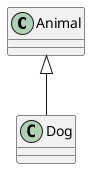
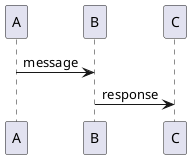

# Lesson Output Pipeline Implementation Plan

> **For Claude:** REQUIRED SUB-SKILL: Use superpowers:executing-plans to implement this plan task-by-task.

**Goal:** Transform lesson generation from raw text dump to structured file artifacts (audio script, audio file, markdown, PDF, diagrams, exercises).

**Architecture:** Parse LessonAgent output into sections, run content pipeline to generate artifacts in `data/lessons/{subject}/{date}/`, display summary tree in CLI.

**Tech Stack:** Python 3.11, Rich (CLI), PlantUML (diagrams), Pandoc (PDF), Coqui/Piper TTS (audio)

---

## Task 1: Create Content Parser Module

**Files:**
- Create: `src/chiron/content/parser.py`
- Create: `tests/test_parser.py`

**Step 1: Write failing test for ParsedLesson dataclass**

```python
# tests/test_parser.py
"""Tests for lesson content parser."""

from chiron.content.parser import DiagramSpec, ParsedLesson


def test_parsed_lesson_dataclass():
    """Test that ParsedLesson can be instantiated."""
    lesson = ParsedLesson(
        title="Test Lesson",
        objectives=["Learn X", "Understand Y"],
        audio_script="Hello, welcome to the lesson.",
        diagrams=[],
        exercise_seeds=[],
        srs_items=[],
    )
    assert lesson.title == "Test Lesson"
    assert len(lesson.objectives) == 2
    assert lesson.audio_script == "Hello, welcome to the lesson."


def test_diagram_spec_dataclass():
    """Test that DiagramSpec can be instantiated."""
    diagram = DiagramSpec(
        title="Test Diagram",
        puml_code="@startuml\nA -> B\n@enduml",
        caption="A simple diagram",
    )
    assert diagram.title == "Test Diagram"
    assert "@startuml" in diagram.puml_code
```

**Step 2: Run test to verify it fails**

Run: `uv run pytest tests/test_parser.py -v`
Expected: FAIL with "ModuleNotFoundError: No module named 'chiron.content.parser'"

**Step 3: Write minimal implementation for dataclasses**

```python
# src/chiron/content/parser.py
"""Parser for LessonAgent structured output."""

from dataclasses import dataclass


@dataclass
class DiagramSpec:
    """Specification for a PlantUML diagram."""

    title: str
    puml_code: str
    caption: str


@dataclass
class ParsedLesson:
    """Parsed lesson content with all sections extracted."""

    title: str
    objectives: list[str]
    audio_script: str
    diagrams: list[DiagramSpec]
    exercise_seeds: list[dict]
    srs_items: list[tuple[str, str]]
```

**Step 4: Run test to verify it passes**

Run: `uv run pytest tests/test_parser.py -v`
Expected: PASS

**Step 5: Commit**

```bash
git add src/chiron/content/parser.py tests/test_parser.py
git commit -m "feat(parser): add ParsedLesson and DiagramSpec dataclasses"
```

---

## Task 2: Implement Title and Objectives Parsing

**Files:**
- Modify: `src/chiron/content/parser.py`
- Modify: `tests/test_parser.py`

**Step 1: Write failing test for title extraction**

```python
# tests/test_parser.py - add to existing file

from chiron.content.parser import parse_lesson_content


def test_parse_title():
    """Test that title is extracted from lesson header."""
    content = """# Lesson: Introduction to Python

## Learning Objectives
1. Understand variables
2. Learn basic syntax

## Audio Script

Welcome to the lesson.
"""
    parsed = parse_lesson_content(content)
    assert parsed.title == "Introduction to Python"


def test_parse_objectives():
    """Test that objectives are extracted as list."""
    content = """# Lesson: Test

## Learning Objectives
1. First objective
2. Second objective
3. Third objective

## Audio Script

Content here.
"""
    parsed = parse_lesson_content(content)
    assert len(parsed.objectives) == 3
    assert parsed.objectives[0] == "First objective"
    assert parsed.objectives[2] == "Third objective"
```

**Step 2: Run test to verify it fails**

Run: `uv run pytest tests/test_parser.py::test_parse_title -v`
Expected: FAIL with "cannot import name 'parse_lesson_content'"

**Step 3: Write implementation**

```python
# src/chiron/content/parser.py - add to existing file
import re


def parse_lesson_content(content: str) -> ParsedLesson:
    """Parse structured lesson content into sections.

    Args:
        content: Raw markdown output from LessonAgent

    Returns:
        ParsedLesson with extracted sections
    """
    # Extract title from "# Lesson: Title" header
    title_match = re.search(r"^# Lesson:\s*(.+)$", content, re.MULTILINE)
    title = title_match.group(1).strip() if title_match else "Untitled Lesson"

    # Extract objectives from numbered list under ## Learning Objectives
    objectives: list[str] = []
    objectives_match = re.search(
        r"## Learning Objectives\s*\n((?:\d+\.\s+.+\n?)+)",
        content,
        re.MULTILINE,
    )
    if objectives_match:
        objectives_text = objectives_match.group(1)
        objectives = [
            re.sub(r"^\d+\.\s+", "", line.strip())
            for line in objectives_text.strip().split("\n")
            if line.strip()
        ]

    return ParsedLesson(
        title=title,
        objectives=objectives,
        audio_script="",
        diagrams=[],
        exercise_seeds=[],
        srs_items=[],
    )
```

**Step 4: Run tests to verify they pass**

Run: `uv run pytest tests/test_parser.py::test_parse_title tests/test_parser.py::test_parse_objectives -v`
Expected: PASS

**Step 5: Commit**

```bash
git add src/chiron/content/parser.py tests/test_parser.py
git commit -m "feat(parser): add title and objectives extraction"
```

---

## Task 3: Implement Audio Script Parsing

**Files:**
- Modify: `src/chiron/content/parser.py`
- Modify: `tests/test_parser.py`

**Step 1: Write failing test**

```python
# tests/test_parser.py - add to existing file

def test_parse_audio_script():
    """Test that audio script section is extracted."""
    content = """# Lesson: Test

## Learning Objectives
1. Learn stuff

## Audio Script

Welcome to today's lesson on Python.

We'll cover variables and types.

Let's get started with the basics.

## Visual Aids

### Diagram 1: Overview
"""
    parsed = parse_lesson_content(content)
    assert "Welcome to today's lesson" in parsed.audio_script
    assert "Let's get started" in parsed.audio_script
    # Should not include next section header
    assert "## Visual Aids" not in parsed.audio_script
    assert "### Diagram" not in parsed.audio_script


def test_parse_audio_script_strips_whitespace():
    """Test that audio script has leading/trailing whitespace stripped."""
    content = """# Lesson: Test

## Learning Objectives
1. Learn

## Audio Script


   Hello there.


## Visual Aids
"""
    parsed = parse_lesson_content(content)
    assert parsed.audio_script == "Hello there."
```

**Step 2: Run test to verify it fails**

Run: `uv run pytest tests/test_parser.py::test_parse_audio_script -v`
Expected: FAIL (audio_script is empty string)

**Step 3: Update implementation**

```python
# src/chiron/content/parser.py - update parse_lesson_content function

def parse_lesson_content(content: str) -> ParsedLesson:
    """Parse structured lesson content into sections.

    Args:
        content: Raw markdown output from LessonAgent

    Returns:
        ParsedLesson with extracted sections
    """
    # Extract title from "# Lesson: Title" header
    title_match = re.search(r"^# Lesson:\s*(.+)$", content, re.MULTILINE)
    title = title_match.group(1).strip() if title_match else "Untitled Lesson"

    # Extract objectives from numbered list under ## Learning Objectives
    objectives: list[str] = []
    objectives_match = re.search(
        r"## Learning Objectives\s*\n((?:\d+\.\s+.+\n?)+)",
        content,
        re.MULTILINE,
    )
    if objectives_match:
        objectives_text = objectives_match.group(1)
        objectives = [
            re.sub(r"^\d+\.\s+", "", line.strip())
            for line in objectives_text.strip().split("\n")
            if line.strip()
        ]

    # Extract audio script - everything between ## Audio Script and next ## header
    audio_script = ""
    audio_match = re.search(
        r"## Audio Script\s*\n(.*?)(?=\n## |\Z)",
        content,
        re.DOTALL,
    )
    if audio_match:
        audio_script = audio_match.group(1).strip()

    return ParsedLesson(
        title=title,
        objectives=objectives,
        audio_script=audio_script,
        diagrams=[],
        exercise_seeds=[],
        srs_items=[],
    )
```

**Step 4: Run tests to verify they pass**

Run: `uv run pytest tests/test_parser.py::test_parse_audio_script tests/test_parser.py::test_parse_audio_script_strips_whitespace -v`
Expected: PASS

**Step 5: Commit**

```bash
git add src/chiron/content/parser.py tests/test_parser.py
git commit -m "feat(parser): add audio script extraction"
```

---

## Task 4: Implement Diagram Parsing

**Files:**
- Modify: `src/chiron/content/parser.py`
- Modify: `tests/test_parser.py`

**Step 1: Write failing test**

```python
# tests/test_parser.py - add to existing file

def test_parse_diagrams():
    """Test that PlantUML diagrams are extracted with titles and captions."""
    content = """# Lesson: Test

## Learning Objectives
1. Learn

## Audio Script

Content here.

## Visual Aids

### Diagram 1: Class Hierarchy



This diagram shows the class hierarchy.

### Diagram 2: Sequence Flow



Shows the message flow between components.

## Exercise Seeds
"""
    parsed = parse_lesson_content(content)
    assert len(parsed.diagrams) == 2

    assert parsed.diagrams[0].title == "Class Hierarchy"
    assert "@startuml" in parsed.diagrams[0].puml_code
    assert "class Animal" in parsed.diagrams[0].puml_code
    assert "class hierarchy" in parsed.diagrams[0].caption.lower()

    assert parsed.diagrams[1].title == "Sequence Flow"
    assert "A -> B" in parsed.diagrams[1].puml_code
    assert "message flow" in parsed.diagrams[1].caption.lower()


def test_parse_diagrams_empty_when_no_visual_aids():
    """Test that diagrams list is empty when section missing."""
    content = """# Lesson: Test

## Learning Objectives
1. Learn

## Audio Script

Content.

## Exercise Seeds
"""
    parsed = parse_lesson_content(content)
    assert parsed.diagrams == []
```

**Step 2: Run test to verify it fails**

Run: `uv run pytest tests/test_parser.py::test_parse_diagrams -v`
Expected: FAIL (diagrams is empty)

**Step 3: Update implementation**

```python
# src/chiron/content/parser.py - update parse_lesson_content to add diagram parsing

def parse_lesson_content(content: str) -> ParsedLesson:
    """Parse structured lesson content into sections.

    Args:
        content: Raw markdown output from LessonAgent

    Returns:
        ParsedLesson with extracted sections
    """
    # Extract title from "# Lesson: Title" header
    title_match = re.search(r"^# Lesson:\s*(.+)$", content, re.MULTILINE)
    title = title_match.group(1).strip() if title_match else "Untitled Lesson"

    # Extract objectives from numbered list under ## Learning Objectives
    objectives: list[str] = []
    objectives_match = re.search(
        r"## Learning Objectives\s*\n((?:\d+\.\s+.+\n?)+)",
        content,
        re.MULTILINE,
    )
    if objectives_match:
        objectives_text = objectives_match.group(1)
        objectives = [
            re.sub(r"^\d+\.\s+", "", line.strip())
            for line in objectives_text.strip().split("\n")
            if line.strip()
        ]

    # Extract audio script - everything between ## Audio Script and next ## header
    audio_script = ""
    audio_match = re.search(
        r"## Audio Script\s*\n(.*?)(?=\n## |\Z)",
        content,
        re.DOTALL,
    )
    if audio_match:
        audio_script = audio_match.group(1).strip()

    # Extract diagrams from Visual Aids section
    diagrams: list[DiagramSpec] = []
    # Pattern: ### Diagram N: Title, then plantuml block, then caption paragraph
    diagram_pattern = re.compile(
        r"### Diagram \d+:\s*(.+?)\n\s*"  # Title
        r"```plantuml\s*\n(.*?)```\s*\n"  # PlantUML code
        r"(.*?)(?=\n### Diagram|\n## |\Z)",  # Caption (until next diagram or section)
        re.DOTALL,
    )
    for match in diagram_pattern.finditer(content):
        diagrams.append(
            DiagramSpec(
                title=match.group(1).strip(),
                puml_code=match.group(2).strip(),
                caption=match.group(3).strip(),
            )
        )

    return ParsedLesson(
        title=title,
        objectives=objectives,
        audio_script=audio_script,
        diagrams=diagrams,
        exercise_seeds=[],
        srs_items=[],
    )
```

**Step 4: Run tests to verify they pass**

Run: `uv run pytest tests/test_parser.py::test_parse_diagrams tests/test_parser.py::test_parse_diagrams_empty_when_no_visual_aids -v`
Expected: PASS

**Step 5: Commit**

```bash
git add src/chiron/content/parser.py tests/test_parser.py
git commit -m "feat(parser): add diagram extraction with titles and captions"
```

---

## Task 5: Implement Exercise Seeds Parsing

**Files:**
- Modify: `src/chiron/content/parser.py`
- Modify: `tests/test_parser.py`

**Step 1: Write failing test**

```python
# tests/test_parser.py - add to existing file
import json


def test_parse_exercise_seeds():
    """Test that exercise seeds JSON is extracted."""
    seeds = [
        {
            "type": "scenario",
            "prompt": "What happens when X?",
            "key_concepts": ["concept1", "concept2"],
            "expected_understanding": "User explains Y",
        },
        {
            "type": "application",
            "prompt": "Apply Z to situation",
            "key_concepts": ["concept3"],
            "expected_understanding": "User demonstrates Z",
        },
    ]
    content = f"""# Lesson: Test

## Learning Objectives
1. Learn

## Audio Script

Content.

## Exercise Seeds

```json
{json.dumps(seeds, indent=2)}
```

## SRS Items
"""
    parsed = parse_lesson_content(content)
    assert len(parsed.exercise_seeds) == 2
    assert parsed.exercise_seeds[0]["type"] == "scenario"
    assert parsed.exercise_seeds[1]["prompt"] == "Apply Z to situation"


def test_parse_exercise_seeds_invalid_json():
    """Test that invalid JSON returns empty list with no crash."""
    content = """# Lesson: Test

## Learning Objectives
1. Learn

## Audio Script

Content.

## Exercise Seeds

```json
{invalid json here}
```

## SRS Items
"""
    parsed = parse_lesson_content(content)
    assert parsed.exercise_seeds == []
```

**Step 2: Run test to verify it fails**

Run: `uv run pytest tests/test_parser.py::test_parse_exercise_seeds -v`
Expected: FAIL (exercise_seeds is empty)

**Step 3: Update implementation**

```python
# src/chiron/content/parser.py - add import and update function
import json
import logging

logger = logging.getLogger(__name__)


def parse_lesson_content(content: str) -> ParsedLesson:
    """Parse structured lesson content into sections.

    Args:
        content: Raw markdown output from LessonAgent

    Returns:
        ParsedLesson with extracted sections
    """
    # ... existing code for title, objectives, audio_script, diagrams ...

    # Extract exercise seeds from JSON code block
    exercise_seeds: list[dict] = []
    exercises_match = re.search(
        r"## Exercise Seeds\s*\n\s*```json\s*\n(.*?)```",
        content,
        re.DOTALL,
    )
    if exercises_match:
        try:
            exercise_seeds = json.loads(exercises_match.group(1).strip())
        except json.JSONDecodeError as e:
            logger.warning("Failed to parse exercise seeds JSON: %s", e)
            exercise_seeds = []

    return ParsedLesson(
        title=title,
        objectives=objectives,
        audio_script=audio_script,
        diagrams=diagrams,
        exercise_seeds=exercise_seeds,
        srs_items=[],
    )
```

**Step 4: Run tests to verify they pass**

Run: `uv run pytest tests/test_parser.py::test_parse_exercise_seeds tests/test_parser.py::test_parse_exercise_seeds_invalid_json -v`
Expected: PASS

**Step 5: Commit**

```bash
git add src/chiron/content/parser.py tests/test_parser.py
git commit -m "feat(parser): add exercise seeds JSON extraction"
```

---

## Task 6: Implement SRS Items Parsing

**Files:**
- Modify: `src/chiron/content/parser.py`
- Modify: `tests/test_parser.py`

**Step 1: Write failing test**

```python
# tests/test_parser.py - add to existing file

def test_parse_srs_items():
    """Test that SRS items are parsed as front|back tuples."""
    content = """# Lesson: Test

## Learning Objectives
1. Learn

## Audio Script

Content.

## SRS Items

- What is X? | X is the first letter
- Define Y | Y means something
- How does Z work? | Z processes data
"""
    parsed = parse_lesson_content(content)
    assert len(parsed.srs_items) == 3
    assert parsed.srs_items[0] == ("What is X?", "X is the first letter")
    assert parsed.srs_items[1] == ("Define Y", "Y means something")
    assert parsed.srs_items[2] == ("How does Z work?", "Z processes data")


def test_parse_srs_items_empty_when_missing():
    """Test that srs_items is empty when section missing."""
    content = """# Lesson: Test

## Learning Objectives
1. Learn

## Audio Script

Content.
"""
    parsed = parse_lesson_content(content)
    assert parsed.srs_items == []
```

**Step 2: Run test to verify it fails**

Run: `uv run pytest tests/test_parser.py::test_parse_srs_items -v`
Expected: FAIL (srs_items is empty)

**Step 3: Update implementation**

```python
# src/chiron/content/parser.py - update parse_lesson_content to add SRS parsing

def parse_lesson_content(content: str) -> ParsedLesson:
    # ... existing code ...

    # Extract SRS items from "- front | back" format
    srs_items: list[tuple[str, str]] = []
    srs_match = re.search(
        r"## SRS Items\s*\n((?:- .+\n?)+)",
        content,
        re.MULTILINE,
    )
    if srs_match:
        srs_text = srs_match.group(1)
        for line in srs_text.strip().split("\n"):
            line = line.strip()
            if line.startswith("- ") and "|" in line:
                parts = line[2:].split("|", 1)  # Remove "- " prefix, split on first |
                if len(parts) == 2:
                    srs_items.append((parts[0].strip(), parts[1].strip()))

    return ParsedLesson(
        title=title,
        objectives=objectives,
        audio_script=audio_script,
        diagrams=diagrams,
        exercise_seeds=exercise_seeds,
        srs_items=srs_items,
    )
```

**Step 4: Run tests to verify they pass**

Run: `uv run pytest tests/test_parser.py::test_parse_srs_items tests/test_parser.py::test_parse_srs_items_empty_when_missing -v`
Expected: PASS

**Step 5: Commit**

```bash
git add src/chiron/content/parser.py tests/test_parser.py
git commit -m "feat(parser): add SRS items extraction"
```

---

## Task 7: Create LessonArtifacts Dataclass and Pipeline Module

**Files:**
- Create: `src/chiron/content/pipeline.py`
- Create: `tests/test_pipeline.py`

**Step 1: Write failing test**

```python
# tests/test_pipeline.py
"""Tests for lesson artifact pipeline."""

from pathlib import Path

from chiron.content.pipeline import LessonArtifacts


def test_lesson_artifacts_dataclass():
    """Test that LessonArtifacts can be instantiated."""
    artifacts = LessonArtifacts(
        output_dir=Path("/tmp/lesson"),
        script_path=Path("/tmp/lesson/script.txt"),
        audio_path=None,
        markdown_path=Path("/tmp/lesson/lesson.md"),
        pdf_path=None,
        diagram_paths=[],
        exercises_path=Path("/tmp/lesson/exercises.json"),
        srs_items_added=5,
    )
    assert artifacts.output_dir == Path("/tmp/lesson")
    assert artifacts.audio_path is None
    assert artifacts.srs_items_added == 5
```

**Step 2: Run test to verify it fails**

Run: `uv run pytest tests/test_pipeline.py -v`
Expected: FAIL with "ModuleNotFoundError"

**Step 3: Write minimal implementation**

```python
# src/chiron/content/pipeline.py
"""Pipeline for generating lesson artifacts."""

from dataclasses import dataclass
from pathlib import Path


@dataclass
class LessonArtifacts:
    """Container for all generated lesson artifacts."""

    output_dir: Path
    script_path: Path
    audio_path: Path | None
    markdown_path: Path
    pdf_path: Path | None
    diagram_paths: list[Path]
    exercises_path: Path
    srs_items_added: int
```

**Step 4: Run test to verify it passes**

Run: `uv run pytest tests/test_pipeline.py -v`
Expected: PASS

**Step 5: Commit**

```bash
git add src/chiron/content/pipeline.py tests/test_pipeline.py
git commit -m "feat(pipeline): add LessonArtifacts dataclass"
```

---

## Task 8: Implement Tool Availability Check

**Files:**
- Modify: `src/chiron/content/pipeline.py`
- Modify: `tests/test_pipeline.py`

**Step 1: Write failing test**

```python
# tests/test_pipeline.py - add to existing file

from chiron.content.pipeline import check_available_tools


def test_check_available_tools_returns_dict():
    """Test that check_available_tools returns expected keys."""
    tools = check_available_tools()
    assert "coqui" in tools
    assert "piper" in tools
    assert "plantuml" in tools
    assert "pandoc" in tools
    # All values should be booleans
    assert all(isinstance(v, bool) for v in tools.values())
```

**Step 2: Run test to verify it fails**

Run: `uv run pytest tests/test_pipeline.py::test_check_available_tools_returns_dict -v`
Expected: FAIL with "cannot import name 'check_available_tools'"

**Step 3: Write implementation**

```python
# src/chiron/content/pipeline.py - add to existing file
import shutil


def _try_import(module_name: str) -> bool:
    """Try to import a module and return whether it succeeded."""
    try:
        __import__(module_name)
        return True
    except ImportError:
        return False


def check_available_tools() -> dict[str, bool]:
    """Check which content generation tools are available.

    Returns:
        Dictionary mapping tool names to availability booleans.
    """
    return {
        "coqui": _try_import("TTS"),
        "piper": _try_import("piper"),
        "plantuml": shutil.which("plantuml") is not None,
        "pandoc": shutil.which("pandoc") is not None,
    }
```

**Step 4: Run test to verify it passes**

Run: `uv run pytest tests/test_pipeline.py::test_check_available_tools_returns_dict -v`
Expected: PASS

**Step 5: Commit**

```bash
git add src/chiron/content/pipeline.py tests/test_pipeline.py
git commit -m "feat(pipeline): add tool availability check"
```

---

## Task 9: Implement Slug Generation Utility

**Files:**
- Modify: `src/chiron/content/pipeline.py`
- Modify: `tests/test_pipeline.py`

**Step 1: Write failing test**

```python
# tests/test_pipeline.py - add to existing file

from chiron.content.pipeline import slugify


def test_slugify_simple():
    """Test slugify with simple title."""
    assert slugify("Card Strength") == "card-strength"


def test_slugify_special_chars():
    """Test slugify removes special characters."""
    assert slugify("What's Next?") == "whats-next"
    assert slugify("Class/Type Hierarchy") == "classtype-hierarchy"


def test_slugify_multiple_spaces():
    """Test slugify handles multiple spaces."""
    assert slugify("Too   Many   Spaces") == "too-many-spaces"
```

**Step 2: Run test to verify it fails**

Run: `uv run pytest tests/test_pipeline.py::test_slugify_simple -v`
Expected: FAIL with "cannot import name 'slugify'"

**Step 3: Write implementation**

```python
# src/chiron/content/pipeline.py - add to existing file
import re


def slugify(text: str) -> str:
    """Convert text to URL-friendly slug.

    Args:
        text: Text to slugify

    Returns:
        Lowercase slug with hyphens instead of spaces
    """
    # Lowercase
    slug = text.lower()
    # Remove non-alphanumeric (except spaces)
    slug = re.sub(r"[^a-z0-9\s]", "", slug)
    # Replace spaces with hyphens
    slug = re.sub(r"\s+", "-", slug.strip())
    return slug
```

**Step 4: Run tests to verify they pass**

Run: `uv run pytest tests/test_pipeline.py::test_slugify_simple tests/test_pipeline.py::test_slugify_special_chars tests/test_pipeline.py::test_slugify_multiple_spaces -v`
Expected: PASS

**Step 5: Commit**

```bash
git add src/chiron/content/pipeline.py tests/test_pipeline.py
git commit -m "feat(pipeline): add slugify utility for diagram filenames"
```

---

## Task 10: Implement generate_lesson_artifacts Function

**Files:**
- Modify: `src/chiron/content/pipeline.py`
- Modify: `tests/test_pipeline.py`

**Step 1: Write failing test**

```python
# tests/test_pipeline.py - add to existing file
import json
import tempfile

from chiron.content.parser import DiagramSpec, ParsedLesson
from chiron.content.pipeline import generate_lesson_artifacts


def test_generate_lesson_artifacts_creates_directory(tmp_path):
    """Test that output directory is created."""
    parsed = ParsedLesson(
        title="Test Lesson",
        objectives=["Learn X"],
        audio_script="Hello world.",
        diagrams=[],
        exercise_seeds=[],
        srs_items=[],
    )
    output_dir = tmp_path / "lesson-2025-01-01"

    artifacts = generate_lesson_artifacts(parsed, output_dir)

    assert output_dir.exists()
    assert artifacts.output_dir == output_dir


def test_generate_lesson_artifacts_creates_script_txt(tmp_path):
    """Test that script.txt is created with audio script."""
    parsed = ParsedLesson(
        title="Test Lesson",
        objectives=["Learn X"],
        audio_script="Welcome to the lesson.\n\nThis is the content.",
        diagrams=[],
        exercise_seeds=[],
        srs_items=[],
    )

    artifacts = generate_lesson_artifacts(parsed, tmp_path)

    assert artifacts.script_path.exists()
    assert artifacts.script_path.name == "script.txt"
    content = artifacts.script_path.read_text()
    assert "Welcome to the lesson" in content


def test_generate_lesson_artifacts_creates_exercises_json(tmp_path):
    """Test that exercises.json is created."""
    seeds = [{"type": "scenario", "prompt": "What if?"}]
    parsed = ParsedLesson(
        title="Test Lesson",
        objectives=["Learn X"],
        audio_script="Content.",
        diagrams=[],
        exercise_seeds=seeds,
        srs_items=[],
    )

    artifacts = generate_lesson_artifacts(parsed, tmp_path)

    assert artifacts.exercises_path.exists()
    assert artifacts.exercises_path.name == "exercises.json"
    loaded = json.loads(artifacts.exercises_path.read_text())
    assert loaded == seeds


def test_generate_lesson_artifacts_creates_lesson_md(tmp_path):
    """Test that lesson.md is created with title and objectives."""
    parsed = ParsedLesson(
        title="My Test Lesson",
        objectives=["Understand concepts", "Apply knowledge"],
        audio_script="Content.",
        diagrams=[],
        exercise_seeds=[],
        srs_items=[],
    )

    artifacts = generate_lesson_artifacts(parsed, tmp_path)

    assert artifacts.markdown_path.exists()
    md_content = artifacts.markdown_path.read_text()
    assert "# My Test Lesson" in md_content
    assert "Understand concepts" in md_content
    assert "Apply knowledge" in md_content
```

**Step 2: Run test to verify it fails**

Run: `uv run pytest tests/test_pipeline.py::test_generate_lesson_artifacts_creates_directory -v`
Expected: FAIL with "cannot import name 'generate_lesson_artifacts'"

**Step 3: Write implementation**

```python
# src/chiron/content/pipeline.py - add to existing file
import json
from chiron.content.parser import ParsedLesson


def generate_lesson_artifacts(
    parsed: ParsedLesson,
    output_dir: Path,
) -> LessonArtifacts:
    """Generate all lesson artifacts from parsed content.

    Args:
        parsed: Parsed lesson content
        output_dir: Directory to write artifacts

    Returns:
        LessonArtifacts with paths to all generated files
    """
    # Create output directory
    output_dir.mkdir(parents=True, exist_ok=True)

    # Write script.txt
    script_path = output_dir / "script.txt"
    script_path.write_text(parsed.audio_script, encoding="utf-8")

    # Write exercises.json
    exercises_path = output_dir / "exercises.json"
    exercises_path.write_text(
        json.dumps(parsed.exercise_seeds, indent=2),
        encoding="utf-8",
    )

    # Write lesson.md
    markdown_path = output_dir / "lesson.md"
    md_lines = [
        f"# {parsed.title}",
        "",
        "## Learning Objectives",
        "",
    ]
    for i, obj in enumerate(parsed.objectives, 1):
        md_lines.append(f"{i}. {obj}")
    md_lines.append("")

    markdown_path.write_text("\n".join(md_lines), encoding="utf-8")

    return LessonArtifacts(
        output_dir=output_dir,
        script_path=script_path,
        audio_path=None,  # TTS not yet implemented
        markdown_path=markdown_path,
        pdf_path=None,  # Pandoc not yet implemented
        diagram_paths=[],  # Diagrams not yet implemented
        exercises_path=exercises_path,
        srs_items_added=0,  # Database integration not yet done
    )
```

**Step 4: Run tests to verify they pass**

Run: `uv run pytest tests/test_pipeline.py::test_generate_lesson_artifacts_creates_directory tests/test_pipeline.py::test_generate_lesson_artifacts_creates_script_txt tests/test_pipeline.py::test_generate_lesson_artifacts_creates_exercises_json tests/test_pipeline.py::test_generate_lesson_artifacts_creates_lesson_md -v`
Expected: PASS

**Step 5: Commit**

```bash
git add src/chiron/content/pipeline.py tests/test_pipeline.py
git commit -m "feat(pipeline): implement basic artifact generation"
```

---

## Task 11: Add Diagram Processing to Pipeline

**Files:**
- Modify: `src/chiron/content/pipeline.py`
- Modify: `tests/test_pipeline.py`

**Step 1: Write failing test**

```python
# tests/test_pipeline.py - add to existing file

def test_generate_lesson_artifacts_saves_diagrams(tmp_path):
    """Test that diagrams are saved as .puml files."""
    parsed = ParsedLesson(
        title="Test",
        objectives=["Learn"],
        audio_script="Content.",
        diagrams=[
            DiagramSpec(
                title="Class Diagram",
                puml_code="@startuml\nclass Foo\n@enduml",
                caption="Shows classes.",
            ),
        ],
        exercise_seeds=[],
        srs_items=[],
    )

    artifacts = generate_lesson_artifacts(parsed, tmp_path)

    diagrams_dir = tmp_path / "diagrams"
    assert diagrams_dir.exists()
    puml_files = list(diagrams_dir.glob("*.puml"))
    assert len(puml_files) == 1
    assert "class-diagram.puml" in [f.name for f in puml_files]


def test_generate_lesson_artifacts_includes_diagrams_in_markdown(tmp_path):
    """Test that markdown includes diagram image references."""
    parsed = ParsedLesson(
        title="Test",
        objectives=["Learn"],
        audio_script="Content.",
        diagrams=[
            DiagramSpec(
                title="Flow Chart",
                puml_code="@startuml\nA -> B\n@enduml",
                caption="Shows the flow.",
            ),
        ],
        exercise_seeds=[],
        srs_items=[],
    )

    artifacts = generate_lesson_artifacts(parsed, tmp_path)

    md_content = artifacts.markdown_path.read_text()
    assert "![Flow Chart]" in md_content
    assert "diagrams/flow-chart.png" in md_content
    assert "Shows the flow" in md_content
```

**Step 2: Run test to verify it fails**

Run: `uv run pytest tests/test_pipeline.py::test_generate_lesson_artifacts_saves_diagrams -v`
Expected: FAIL (no diagrams directory created)

**Step 3: Update implementation**

```python
# src/chiron/content/pipeline.py - update generate_lesson_artifacts

from chiron.content.diagrams import render_diagram, save_diagram


def generate_lesson_artifacts(
    parsed: ParsedLesson,
    output_dir: Path,
) -> LessonArtifacts:
    """Generate all lesson artifacts from parsed content.

    Args:
        parsed: Parsed lesson content
        output_dir: Directory to write artifacts

    Returns:
        LessonArtifacts with paths to all generated files
    """
    # Create output directory
    output_dir.mkdir(parents=True, exist_ok=True)

    # Write script.txt
    script_path = output_dir / "script.txt"
    script_path.write_text(parsed.audio_script, encoding="utf-8")

    # Write exercises.json
    exercises_path = output_dir / "exercises.json"
    exercises_path.write_text(
        json.dumps(parsed.exercise_seeds, indent=2),
        encoding="utf-8",
    )

    # Process diagrams
    diagram_paths: list[Path] = []
    diagrams_dir = output_dir / "diagrams"
    diagram_refs: list[tuple[str, str, str]] = []  # (title, filename, caption)

    for diagram in parsed.diagrams:
        slug = slugify(diagram.title)
        puml_path = save_diagram(diagram.puml_code, diagrams_dir, slug)
        diagram_paths.append(puml_path)

        # Try to render to PNG
        png_path = render_diagram(puml_path, "png")
        if png_path:
            diagram_paths.append(png_path)

        # Store reference for markdown (assume PNG will exist or fallback)
        diagram_refs.append((diagram.title, f"{slug}.png", diagram.caption))

    # Write lesson.md
    markdown_path = output_dir / "lesson.md"
    md_lines = [
        f"# {parsed.title}",
        "",
        "## Learning Objectives",
        "",
    ]
    for i, obj in enumerate(parsed.objectives, 1):
        md_lines.append(f"{i}. {obj}")
    md_lines.append("")

    # Add diagram section if we have diagrams
    if diagram_refs:
        md_lines.extend(["## Visual Aids", ""])
        for title, filename, caption in diagram_refs:
            md_lines.extend([
                f"### {title}",
                "",
                f"",
                "",
                caption,
                "",
            ])

    markdown_path.write_text("\n".join(md_lines), encoding="utf-8")

    return LessonArtifacts(
        output_dir=output_dir,
        script_path=script_path,
        audio_path=None,
        markdown_path=markdown_path,
        pdf_path=None,
        diagram_paths=diagram_paths,
        exercises_path=exercises_path,
        srs_items_added=0,
    )
```

**Step 4: Run tests to verify they pass**

Run: `uv run pytest tests/test_pipeline.py::test_generate_lesson_artifacts_saves_diagrams tests/test_pipeline.py::test_generate_lesson_artifacts_includes_diagrams_in_markdown -v`
Expected: PASS

**Step 5: Commit**

```bash
git add src/chiron/content/pipeline.py tests/test_pipeline.py
git commit -m "feat(pipeline): add diagram processing to artifact generation"
```

---

## Task 12: Add PDF Generation via Pandoc

**Files:**
- Modify: `src/chiron/content/pipeline.py`
- Modify: `tests/test_pipeline.py`

**Step 1: Write failing test**

```python
# tests/test_pipeline.py - add to existing file
from unittest.mock import patch


def test_generate_lesson_artifacts_creates_pdf_when_pandoc_available(tmp_path):
    """Test that PDF is created when pandoc is available."""
    parsed = ParsedLesson(
        title="Test",
        objectives=["Learn"],
        audio_script="Content.",
        diagrams=[],
        exercise_seeds=[],
        srs_items=[],
    )

    # Mock pandoc being available and successful
    with patch("shutil.which", return_value="/usr/bin/pandoc"):
        with patch("subprocess.run") as mock_run:
            mock_run.return_value.returncode = 0
            artifacts = generate_lesson_artifacts(parsed, tmp_path)

    # PDF path should be set (even though file won't exist in mock)
    assert artifacts.pdf_path == tmp_path / "lesson.pdf"


def test_generate_lesson_artifacts_pdf_none_when_pandoc_unavailable(tmp_path):
    """Test that PDF is None when pandoc not available."""
    parsed = ParsedLesson(
        title="Test",
        objectives=["Learn"],
        audio_script="Content.",
        diagrams=[],
        exercise_seeds=[],
        srs_items=[],
    )

    with patch("chiron.content.pipeline.check_available_tools", return_value={"pandoc": False, "plantuml": False, "coqui": False, "piper": False}):
        artifacts = generate_lesson_artifacts(parsed, tmp_path)

    assert artifacts.pdf_path is None
```

**Step 2: Run test to verify it fails**

Run: `uv run pytest tests/test_pipeline.py::test_generate_lesson_artifacts_creates_pdf_when_pandoc_available -v`
Expected: FAIL (pdf_path is always None currently)

**Step 3: Update implementation**

```python
# src/chiron/content/pipeline.py - add subprocess import and update function
import subprocess
import logging

logger = logging.getLogger(__name__)


def generate_lesson_artifacts(
    parsed: ParsedLesson,
    output_dir: Path,
) -> LessonArtifacts:
    # ... existing code up to markdown generation ...

    markdown_path.write_text("\n".join(md_lines), encoding="utf-8")

    # Generate PDF via pandoc if available
    pdf_path: Path | None = None
    tools = check_available_tools()
    if tools.get("pandoc"):
        pdf_path = output_dir / "lesson.pdf"
        try:
            result = subprocess.run(
                ["pandoc", str(markdown_path), "-o", str(pdf_path)],
                capture_output=True,
                text=True,
            )
            if result.returncode != 0:
                logger.warning("Pandoc failed: %s", result.stderr)
                pdf_path = None
        except Exception as e:
            logger.warning("Pandoc error: %s", e)
            pdf_path = None

    return LessonArtifacts(
        output_dir=output_dir,
        script_path=script_path,
        audio_path=None,
        markdown_path=markdown_path,
        pdf_path=pdf_path,
        diagram_paths=diagram_paths,
        exercises_path=exercises_path,
        srs_items_added=0,
    )
```

**Step 4: Run tests to verify they pass**

Run: `uv run pytest tests/test_pipeline.py::test_generate_lesson_artifacts_creates_pdf_when_pandoc_available tests/test_pipeline.py::test_generate_lesson_artifacts_pdf_none_when_pandoc_unavailable -v`
Expected: PASS

**Step 5: Commit**

```bash
git add src/chiron/content/pipeline.py tests/test_pipeline.py
git commit -m "feat(pipeline): add PDF generation via pandoc"
```

---

## Task 13: Update LessonAgent Prompt for New Output Format

**Files:**
- Modify: `src/chiron/agents/lesson.py`

**Step 1: No test needed - this is a prompt change**

The LessonAgent prompt needs to be updated to output the new structured format with JSON exercise seeds instead of inline exercise text.

**Step 2: Update the prompt**

```python
# src/chiron/agents/lesson.py - replace LESSON_AGENT_PROMPT

LESSON_AGENT_PROMPT = """\
You are the Lesson Agent for Chiron, an AI-powered adaptive learning platform.

Your role is to generate personalized, multi-modal lesson content tailored to the
learner's current state, knowledge gaps, and learning objectives.

## Your Responsibilities

1. **Analyze Learning State**
   - Review the assessment summary to understand current knowledge level
   - Identify knowledge gaps and misconceptions to address
   - Consider SRS review items that need reinforcement
   - Understand the learner's progress through the curriculum

2. **Generate Audio Script**
   - Create a conversational, engaging audio lesson (~15 minutes when read aloud)
   - Use a warm, encouraging tone appropriate for learning
   - Build on what the learner already knows
   - Introduce new concepts incrementally
   - Include analogies, examples, and real-world applications
   - Output as plain text paragraphs (no markdown formatting)
   - Summarize key points at the end

3. **Generate Visual Aids**
   - Create PlantUML diagrams to illustrate concepts
   - Use appropriate diagram types:
     - Class diagrams for relationships/hierarchies
     - Sequence diagrams for processes/workflows
     - Mind maps for concept relationships
     - State diagrams for transitions
   - Keep diagrams simple and focused on one concept each
   - Include a brief caption after each diagram

4. **Generate Exercise Seeds**
   - Create prompts for interactive exercises (not full questions)
   - Include metadata for adaptive tutoring
   - Output as JSON array

5. **Generate SRS Items**
   - Create flashcard-style items for spaced repetition
   - Use "front | back" format

## Output Format

You MUST follow this exact format:

```
# Lesson: [Topic Title]

## Learning Objectives
1. [Objective 1]
2. [Objective 2]
3. [Objective 3]

## Audio Script

[Write conversational paragraphs here. No markdown formatting inside
this section - just plain text with paragraph breaks. This will be
converted to audio via text-to-speech.]

## Visual Aids

### Diagram 1: [Descriptive Title]

```plantuml
[PlantUML code]
```

[Brief caption explaining what the diagram shows]

### Diagram 2: [Descriptive Title]

```plantuml
[PlantUML code]
```

[Brief caption explaining what the diagram shows]

## Exercise Seeds

```json
[
  {
    "type": "scenario",
    "prompt": "Description of a scenario the learner must respond to",
    "key_concepts": ["concept1", "concept2"],
    "expected_understanding": "What a good response demonstrates"
  },
  {
    "type": "application",
    "prompt": "Ask learner to apply knowledge to a situation",
    "key_concepts": ["concept3"],
    "expected_understanding": "What correct application looks like"
  }
]
```

## SRS Items

- Question or prompt | Answer or explanation
- Another front | Another back
- Concept to recall | Definition or elaboration
```

## Guidelines

- Adapt difficulty to the learner's assessed level
- Reference prior knowledge to build connections
- Focus on understanding over memorization
- Include practical applications relevant to their learning goal
- Generate 8-12 SRS items per lesson
- Generate 3-5 exercise seeds
- Keep the audio script conversational and engaging
- Audio script should be pure text, no markdown formatting
"""
```

**Step 3: Verify lint passes**

Run: `uv run ruff check src/chiron/agents/lesson.py`
Expected: No errors

**Step 4: Commit**

```bash
git add src/chiron/agents/lesson.py
git commit -m "feat(lesson): update prompt for structured output format"
```

---

## Task 14: Add add_srs_items Method to Database

**Files:**
- Modify: `src/chiron/storage/database.py`
- Modify: `tests/test_database.py` (or create if needed)

**Step 1: Write failing test**

```python
# tests/test_database.py - add to existing file or create

import tempfile
from pathlib import Path

from chiron.storage.database import Database


def test_add_srs_items():
    """Test adding SRS items to database."""
    with tempfile.TemporaryDirectory() as tmpdir:
        db = Database(Path(tmpdir) / "test.db")
        db.initialize()

        # Need a subject first
        from chiron.models import LearningGoal, SubjectStatus
        from datetime import datetime

        goal = LearningGoal(
            subject_id="test-subject",
            purpose_statement="Learn testing",
            created_date=datetime.now(),
            status=SubjectStatus.INITIALIZING,
        )
        db.save_learning_goal(goal)

        # Add SRS items
        items = [
            ("What is X?", "X is a variable"),
            ("Define Y", "Y is a constant"),
        ]
        count = db.add_srs_items("test-subject", items)

        assert count == 2


def test_add_srs_items_empty_list():
    """Test adding empty SRS items list."""
    with tempfile.TemporaryDirectory() as tmpdir:
        db = Database(Path(tmpdir) / "test.db")
        db.initialize()

        count = db.add_srs_items("any-subject", [])
        assert count == 0
```

**Step 2: Run test to verify it fails**

Run: `uv run pytest tests/test_database.py::test_add_srs_items -v`
Expected: FAIL with "AttributeError: 'Database' object has no attribute 'add_srs_items'"

**Step 3: Write implementation**

```python
# src/chiron/storage/database.py - add method to Database class
import hashlib

class Database:
    # ... existing methods ...

    def add_srs_items(
        self,
        subject_id: str,
        items: list[tuple[str, str]],
    ) -> int:
        """Add SRS flashcard items for a subject.

        Args:
            subject_id: The subject these items belong to
            items: List of (front, back) tuples

        Returns:
            Number of items added
        """
        if not items:
            return 0

        with self._get_connection() as conn:
            cursor = conn.cursor()
            now = datetime.now().isoformat()

            for front, back in items:
                # Create hash of question for deduplication
                question_hash = hashlib.md5(front.encode()).hexdigest()

                # Store as response with placeholder node_id (-1 for general SRS)
                cursor.execute(
                    """
                    INSERT INTO responses
                        (node_id, question_hash, response, correct, timestamp, next_review)
                    VALUES (?, ?, ?, ?, ?, ?)
                    """,
                    (
                        -1,  # Placeholder node_id for lesson-generated SRS
                        question_hash,
                        json.dumps({"front": front, "back": back}),
                        0,  # Not yet answered
                        now,
                        now,  # Due immediately for first review
                    ),
                )

            return len(items)
```

**Step 4: Run tests to verify they pass**

Run: `uv run pytest tests/test_database.py::test_add_srs_items tests/test_database.py::test_add_srs_items_empty_list -v`
Expected: PASS

**Step 5: Commit**

```bash
git add src/chiron/storage/database.py tests/test_database.py
git commit -m "feat(database): add add_srs_items method for lesson SRS storage"
```

---

## Task 15: Update Orchestrator to Return LessonArtifacts

**Files:**
- Modify: `src/chiron/orchestrator.py`

**Step 1: Update imports and generate_lesson method**

```python
# src/chiron/orchestrator.py - add import at top
from chiron.content.parser import parse_lesson_content
from chiron.content.pipeline import LessonArtifacts, generate_lesson_artifacts
from datetime import date


# Update generate_lesson method
def generate_lesson(self) -> LessonArtifacts:
    """Generate a lesson based on assessment results.

    Returns:
        LessonArtifacts with paths to all generated files.

    Raises:
        ValueError: If no active subject is set.
    """
    subject_id = self.get_active_subject()
    if subject_id is None:
        raise ValueError("No active subject set")

    self.state = WorkflowState.GENERATING_LESSON

    # Get assessment summary
    assessment_summary = self.assessment_agent.get_assessment_summary()

    # Get knowledge tree for topics
    nodes = self.db.get_knowledge_tree(subject_id)
    topics = [node.title for node in nodes[:5]]

    # Generate raw lesson content
    raw_content = self.lesson_agent.generate_lesson(
        subject_id=subject_id,
        topics=topics if topics else ["Introduction"],
        assessment_summary=assessment_summary,
    )

    # Parse structured output
    parsed = parse_lesson_content(raw_content)

    # Generate artifacts
    output_dir = self.lessons_dir / subject_id / date.today().isoformat()
    artifacts = generate_lesson_artifacts(parsed, output_dir)

    # Store SRS items in database
    if parsed.srs_items:
        self.db.add_srs_items(subject_id, parsed.srs_items)
        # Update artifacts with actual count
        artifacts = LessonArtifacts(
            output_dir=artifacts.output_dir,
            script_path=artifacts.script_path,
            audio_path=artifacts.audio_path,
            markdown_path=artifacts.markdown_path,
            pdf_path=artifacts.pdf_path,
            diagram_paths=artifacts.diagram_paths,
            exercises_path=artifacts.exercises_path,
            srs_items_added=len(parsed.srs_items),
        )

    self.state = WorkflowState.DELIVERING_LESSON
    return artifacts
```

**Step 2: Verify type checking passes**

Run: `uv run mypy src/chiron/orchestrator.py`
Expected: No errors (or fix any that appear)

**Step 3: Commit**

```bash
git add src/chiron/orchestrator.py
git commit -m "feat(orchestrator): return LessonArtifacts from generate_lesson"
```

---

## Task 16: Update CLI to Display Artifact Summary Tree

**Files:**
- Modify: `src/chiron/cli.py`

**Step 1: Update imports**

```python
# src/chiron/cli.py - add import
from rich.tree import Tree
```

**Step 2: Update lesson command handler**

```python
# src/chiron/cli.py - update the 'done' handling in lesson()

def _word_count(path: Path) -> int:
    """Count words in a text file."""
    return len(path.read_text().split())


# In the lesson() function, replace the 'done' block:
if user_input.lower().strip() == "done":
    console.print(
        "\n[yellow]Generating personalized lesson...[/yellow]\n"
    )

    with console.status("[bold green]Creating lesson materials..."):
        artifacts = orchestrator.generate_lesson()

    # Display summary tree
    tree = Tree(f"[bold]Lesson generated: {artifacts.output_dir}[/bold]")

    # Script
    word_count = _word_count(artifacts.script_path)
    tree.add(f"[green]✓[/green] script.txt ({word_count:,} words)")

    # Audio
    if artifacts.audio_path:
        tree.add(f"[green]✓[/green] audio.mp3")
    else:
        tree.add("[yellow]○[/yellow] audio.mp3 (TTS not available)")

    # Markdown
    tree.add(f"[green]✓[/green] lesson.md")

    # PDF
    if artifacts.pdf_path:
        tree.add(f"[green]✓[/green] lesson.pdf")
    else:
        tree.add("[yellow]○[/yellow] lesson.pdf (pandoc not available)")

    # Diagrams
    if artifacts.diagram_paths:
        diagrams_branch = tree.add("diagrams/")
        for p in artifacts.diagram_paths:
            if p.suffix == ".png":
                diagrams_branch.add(f"[green]✓[/green] {p.name}")
    else:
        tree.add("[dim]○[/dim] diagrams/ (none generated)")

    # Exercises
    import json
    exercises = json.loads(artifacts.exercises_path.read_text())
    tree.add(f"[green]✓[/green] exercises.json ({len(exercises)} seeds)")

    # SRS
    if artifacts.srs_items_added > 0:
        tree.add(f"[green]✓[/green] {artifacts.srs_items_added} SRS items added")

    console.print(tree)
    console.print(f"\n[dim]Run 'chiron exercises' to practice.[/dim]")
    break
```

**Step 3: Verify lint passes**

Run: `uv run ruff check src/chiron/cli.py`
Expected: No errors

**Step 4: Commit**

```bash
git add src/chiron/cli.py
git commit -m "feat(cli): display lesson artifact summary tree"
```

---

## Task 17: Add Optional TTS Dependencies to pyproject.toml

**Files:**
- Modify: `pyproject.toml`

**Step 1: Add optional dependencies**

```toml
# pyproject.toml - update [project.optional-dependencies]

[project.optional-dependencies]
dev = [
    "pytest>=8.0.0",
    "pytest-cov>=4.0.0",
    "pytest-asyncio>=0.23.0",
    "ruff>=0.1.0",
    "mypy>=1.8.0",
]
tts = [
    "TTS>=0.22.0",
]
piper = [
    "piper-tts>=1.2.0",
]
```

**Step 2: Commit**

```bash
git add pyproject.toml
git commit -m "feat: add optional TTS dependencies"
```

---

## Task 18: Add plantuml and pandoc to devbox.json

**Files:**
- Modify: `devbox.json`

**Step 1: Update packages**

```json
{
  "$schema": "https://raw.githubusercontent.com/jetify-com/devbox/0.14.2/.schema/devbox.schema.json",
  "packages": [
    "python@3.11",
    "plantuml",
    "pandoc"
  ],
  "shell": {
    "init_hook": [
      "echo 'Welcome to devbox!' > /dev/null"
    ],
    "scripts": {
      "test": [
        "uv run pytest"
      ]
    }
  }
}
```

**Step 2: Commit**

```bash
git add devbox.json
git commit -m "feat: add plantuml and pandoc to devbox"
```

---

## Task 19: Run Full Test Suite and Fix Any Issues

**Files:**
- All test files

**Step 1: Run full test suite**

Run: `uv run pytest -v`
Expected: All tests pass

**Step 2: Run linting**

Run: `uv run ruff check src/ tests/`
Expected: No errors

**Step 3: Run type checking**

Run: `uv run mypy src/chiron/`
Expected: No errors (or minimal acceptable errors)

**Step 4: Fix any issues found**

If any tests fail or linting/type errors appear, fix them.

**Step 5: Final commit**

```bash
git add -A
git commit -m "fix: resolve test and lint issues"
```

---

## Task 20: Manual Integration Test

**Step 1: Run lesson generation end-to-end**

```bash
# Make sure you have an active subject
uv run chiron subjects

# If needed, init a test subject
uv run chiron init
# Enter: "Python basics"
# Enter: "Learn Python fundamentals"
# Skip curriculum design (n)

# Run lesson
uv run chiron lesson
# Answer assessment questions or type 'done' quickly
```

**Step 2: Verify artifacts created**

```bash
# Check data directory
ls -la data/lessons/python-basics/$(date +%Y-%m-%d)/
```

Expected files:
- script.txt
- lesson.md
- exercises.json
- diagrams/ (if PlantUML available)
- lesson.pdf (if Pandoc available)

**Step 3: Commit any final fixes**

```bash
git add -A
git commit -m "fix: final integration fixes"
```

---

## Summary

This plan implements the lesson output pipeline in 20 tasks:

1-6: Parser module (dataclasses, title/objectives/audio/diagrams/exercises/SRS parsing)
7-12: Pipeline module (artifacts dataclass, tool check, slugify, generation, diagrams, PDF)
13: LessonAgent prompt update
14: Database add_srs_items method
15-16: Orchestrator and CLI integration
17-18: Dependencies (pyproject.toml, devbox.json)
19-20: Testing and verification

Each task is a discrete unit that can be completed, tested, and committed independently.
